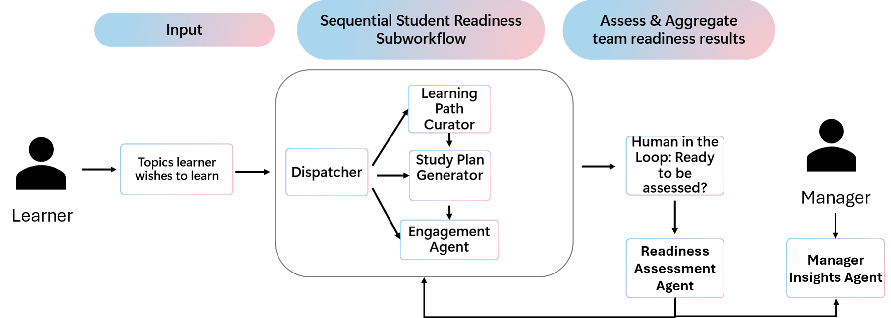

# 🧠 Reasoning Agents - Starter Kit

**Track**: Battle #2 - Reasoning Agents with Microsoft Foundry

Welcome to the Reasoning Agents track. In this challenge, you will build a multi-agent system using **Microsoft Foundry** that demonstrates reasoning, orchestration, grounded knowledge, semantic business understanding, and production-ready deployment patterns.

This version combines the original starter kit scenario with an expanded enterprise scenario that explicitly incorporates **Work IQ**, **Foundry IQ**, **Fabric IQ**, and guidance for deploying the final solution with **Hosted Agents in Foundry Agent Service**.

---

## Prerequisites

Before starting this challenge, ensure you have the following:

### Required Skills
- **Basic Python programming** — variables, functions, classes, and working with APIs
- **Command line familiarity** — navigating directories, running scripts
- **Basic understanding of AI concepts** — what LLMs are, prompts, responses, and tool use

### Required Accounts (Free Tiers Available)
| Account | Purpose | Sign Up |
|---------|---------|---------|
| **GitHub** | Version control and submission | [github.com](https://github.com) |
| **Microsoft Azure** | Access to Microsoft Foundry | [azure.microsoft.com/free](https://aka.ms/azure-free-account) |
| **Discord** | Community support | [aka.ms/agentsleague/discord](https://aka.ms/agentsleague/discord) |

### Required Tools
- **Python 3.10+** — [python.org/downloads](https://python.org/downloads)
- **Visual Studio Code** — [code.visualstudio.com](https://code.visualstudio.com)
- **Git** — [git-scm.com](https://git-scm.com)

### Azure Subscription Notes
> [!IMPORTANT]
> Microsoft Foundry requires an Azure subscription. A **free trial** provides Azure credit for a limited period. Some features may incur costs after the trial. Check the [Azure pricing calculator](https://azure.microsoft.com/pricing/calculator/) to estimate costs.

> [!WARNING]
> **Free Tier Limitations:** A free Azure subscription can have important constraints that may affect this challenge:
> - Limited model access depending on region and quota
> - Tight rate limits
> - Regional restrictions
> - Some orchestration and evaluation features may require pay-as-you-go
>
> **Recommendation:** For fuller access, consider a pay-as-you-go subscription or explore [Azure for Students](https://azure.microsoft.com/free/students/) or [Microsoft for Startups Founders Hub](https://www.microsoft.com/startups).

### ⏱️ Time Commitment
- **Setup**: ~1–2 hours
- **Learning basics**: ~4–6 hours
- **Building solution**: ~10–20 hours depending on complexity

---

## 🛠️ Environment Setup Guidance

### Step 1: Clone the Repository
```bash
git clone https://github.com/YOUR-USERNAME/agentsleague.git
cd agentsleague/starter-kits/2-reasoning-agents
```

### Step 2: Create a Python Virtual Environment
```bash
# Windows
python -m venv .venv
.venv\Scripts\activate

# macOS/Linux
python3 -m venv .venv
source .venv/bin/activate
```

### Step 3: Set Up Azure Credentials
1. Go to [Microsoft Foundry Portal](https://ai.azure.com)
2. Create or select your **AI Project**
3. In your project, go to **Project settings** → **Project properties**
4. Copy the **Project connection string**
5. Create a `.env` file in this directory:

```env
# Option 1: Use Project Connection String (Recommended)
AZURE_AI_PROJECT_CONNECTION_STRING=your-connection-string-here

# Option 2: Use Individual Settings
# AZURE_SUBSCRIPTION_ID=your-subscription-id
# AZURE_RESOURCE_GROUP=your-resource-group
# AZURE_AI_PROJECT_NAME=your-project-name

# Model Deployment Name
AZURE_AI_MODEL_DEPLOYMENT=gpt-4o
```

> [!TIP]
> Keep secrets out of source control. Never commit `.env` files or credentials to GitHub.

---

## Project Ideas

In this track, we encourage you to create a multi-agent solution using one of the following development approaches.

### Development Approaches
1. **Local development:** Build and test your custom agent solution locally with the OSS [Microsoft Agent Framework](https://github.com/microsoft/agent-framework).
2. **Cloud-based development:** Use [Microsoft Foundry](https://azure.microsoft.com/products/ai-foundry/) to orchestrate agents in the cloud using the UI or SDK.

Whatever approach you choose, you are encouraged to:
- Use Microsoft Foundry-hosted, GitHub-hosted, or locally-hosted models where appropriate
- Use visualisation and monitoring tools to understand agent behaviour
- Integrate external tools, APIs, or MCP servers
- Implement evaluations and deployment strategies
- Use AI-assisted development tools such as [GitHub Copilot](https://github.com/features/copilot)

---

## 🌍 Core Challenge Scenario

The original challenge scenario is to build a multi-agent system that helps learners prepare for Microsoft certification exams. The system should be able to:
- Understand the exam syllabus
- Generate study plans
- Provide practice questions
- Offer feedback on performance
- Loop the learner back into preparation when they are not yet ready

### Baseline Flow
1. The learner provides the topics they want to study.
2. A **Learning Path Curator** suggests relevant content.
3. A **Study Plan Generator** converts that content into a practical study plan.
4. An **Engagement Agent** keeps the learner on track through reminders or nudges.
5. Once the learner is ready, an **Assessment Agent** evaluates readiness.
6. If the learner passes, the system suggests the relevant certification and next step. Otherwise, it returns to the preparation workflow.

> [!TIP]
> Some of these capabilities can be extended with the [Microsoft Learn MCP server](https://github.com/microsoftdocs/mcp) and the [Microsoft Learn MCP documentation](https://learn.microsoft.com/training/support/mcp).

---

## 🧠 Expanded Enterprise Scenario with Microsoft IQ

To make the challenge more realistic and enterprise-oriented, extend the student certification assistant into an **enterprise learning and workforce optimisation system**.

In this expanded scenario, your multi-agent solution can support both individual learners and internal team learning programmes by combining:
- **Work IQ** for work context and activity understanding
- **Foundry IQ** for grounded knowledge retrieval
- **Fabric IQ** for semantic and analytical business reasoning
- **Hosted Agents** for managed deployment of the final agent solution

### Example Expanded Use Cases
- A learner requests a certification study plan that adapts to their workload
- A manager wants visibility into team learning progress and risk areas
- An assessment agent generates grounded, cited questions from approved knowledge sources
- A planner agent uses historical study patterns and work signals to recommend realistic study windows

---

## 🧠 Microsoft IQ Integration (Core Requirement)

Your project **must** integrate at least one Microsoft IQ intelligence layer. You can choose one, or combine all three.

### Work IQ
**Work IQ** is the intelligence layer that personalises Microsoft 365 Copilot for users and organisations. Microsoft describes it as combining **data**, **context**, and **skills/tools** so Copilot and agents can respond using organisational signals rather than connector-only approaches. It draws from Microsoft 365 tenant data, metadata and activity patterns, and can also incorporate Dynamics 365, Power Apps, and connected business systems through extensibility. Use it when your agent needs to understand work context, collaboration patterns, or where a task fits into the flow of work.

**Good fit for this challenge**
- Adapt study reminders around meetings and focus time
- Personalise communication based on user work patterns
- Ground engagement decisions in work context

**Reference**
- [Work IQ overview](https://learn.microsoft.com/en-us/microsoft-365/copilot/extensibility/work-iq)

### Foundry IQ
**Foundry IQ** is a configurable, multi-source knowledge layer for Microsoft Foundry. Microsoft states that it provides a **knowledge base** with **knowledge sources** and **agentic retrieval**, returning **permission-aware**, grounded answers with citations. Supported knowledge sources include internal stores such as Azure Blob Storage, SharePoint, and OneLake, as well as public web data. It uses Azure AI Search for indexing and retrieval infrastructure.

**Good fit for this challenge**
- Retrieve certification content from approved documents
- Ground assessment questions in curated material
- Provide cited answers from uploaded or indexed knowledge

**Reference**
- [What is Foundry IQ?](https://learn.microsoft.com/en-us/azure/foundry/agents/concepts/what-is-foundry-iq)

### Fabric IQ
**Fabric IQ** is presented by Microsoft as a semantic foundation within Microsoft Fabric. Microsoft describes it as bringing together **data, meaning, and actions** into a single semantic layer, with **Ontology** at the core. That ontology connects people, processes, systems, actions, rules, and data into unified business entities and relationships so people and AI can reason and act with more confidence.

**Good fit for this challenge**
- Model the relationship between learner, role, certification, skill gap, pass threshold, and study plan
- Analyse completion rates and pass likelihoods
- Reuse semantic meaning across analytics and agent experiences

**Reference**
- [Fabric IQ: The Semantic Foundation for Enterprise AI](https://blog.fabric.microsoft.com/en-in/blog/introducing-fabric-iq-the-semantic-foundation-for-enterprise-ai)

---

## 🏗️ Updated Multi-Agent Architecture

Below is a suggested architecture that combines the original starter kit with the Microsoft IQ layers.


``


### 1. Learning Path Curator Agent
**Primary role:** Suggest relevant learning paths and supporting material.

**Recommended grounding:**
- **Foundry IQ** knowledge base connected to approved learning content
- Optional integration with Microsoft Learn or MCP tools

**What it should do:**
- Map a certification target to relevant skills and resources
- Return cited content rather than unsupported free-text recommendations

### 2. Study Plan Generator Agent
**Primary role:** Convert learning content into a practical study schedule.

**Recommended grounding:**
- **Fabric IQ** semantic layer for modelling certification, role, skill areas, and recommended study hours
- Optional use of synthetic historical learner outcomes

**What it should do:**
- Recommend milestones
- Allocate study hours
- Adjust sequencing based on difficulty or prerequisites

### 3. Engagement Agent
**Primary role:** Keep the learner progressing.

**Recommended grounding:**
- **Work IQ** to understand work context, communication patterns, and preferred timing

**What it should do:**
- Suggest appropriate times for reminders
- Adapt engagement to workload and focus windows
- Avoid one-size-fits-all reminder behaviour

### 4. Assessment Agent
**Primary role:** Evaluate learner readiness.

**Recommended grounding:**
- **Foundry IQ** for grounded question generation
- **Fabric IQ** for interpreting patterns and scoring thresholds

**What it should do:**
- Generate credible questions from approved content
- Score or interpret readiness based on known criteria
- Feed results back into the planning loop

### 5. Manager Insights Agent (Optional but Recommended)
**Primary role:** Provide team-level visibility.

**Recommended grounding:**
- **Work IQ** for organisational context
- **Fabric IQ** for semantic analysis of learning metrics

**What it should do:**
- Summarise learning progress by team or role
- Highlight patterns such as overloaded learners or likely exam risk
- Present insights without exposing sensitive personal data

---

## 🔄 Example End-to-End Flow


1. A learner asks for help preparing for a certification.
2. **Foundry IQ** retrieves grounded learning materials from an approved knowledge base.
3. **Fabric IQ** interprets structured data such as required skills, recommended hours, and prior synthetic study outcomes.
4. **Work IQ** helps identify when learning activity fits best into the learner’s work rhythm.
5. The **Study Plan Generator** produces a practical schedule.
6. The **Engagement Agent** uses work context to keep the learner on track.
7. The **Assessment Agent** creates grounded questions and evaluates progress.
8. The system either recommends the next certification step or loops back into study preparation.

---

## 📊 Synthetic Data and Documents (Required)

> [!IMPORTANT]
> Use **synthetic data only**. Do not use real customer data, real employee data, or any PII.

The original starter kit already requires demo data only and explicitly prohibits customer data, PII, credentials, and confidential information in submissions. In addition, Microsoft’s Foundry synthetic data guidance says to avoid including PII or other sensitive data in the source material used for generation, and to validate outputs before production use.

### Synthetic Data Guidance for This Challenge
Use these practical guardrails:
- Use clearly fabricated identifiers such as `L-1001`, `EMP-001`, or `TEAM-A`
- Do not use real names, real email addresses, real document titles, or real customer records
- Keep examples representative but obviously fictional
- Validate generated outputs before using them in demos or evaluation loops
- Be explicit in your README that the dataset is synthetic and for demonstration only

### Example Synthetic Dataset: Learner Performance
```json
[
  {
    "learner_id": "L-1001",
    "role": "Cloud Engineer",
    "certification": "AZ-204",
    "practice_score_avg": 67,
    "hours_studied": 18,
    "exam_outcome": "Fail"
  },
  {
    "learner_id": "L-1002",
    "role": "DevOps Engineer",
    "certification": "AZ-400",
    "practice_score_avg": 82,
    "hours_studied": 24,
    "exam_outcome": "Pass"
  },
  {
    "learner_id": "L-1003",
    "role": "Data Engineer",
    "certification": "DP-203",
    "practice_score_avg": 74,
    "hours_studied": 20,
    "exam_outcome": "Pass"
  }
]
```

### Example Synthetic Dataset: Work Activity Signals
```json
[
  {
    "employee_id": "EMP-001",
    "meeting_hours_per_week": 22,
    "focus_hours_per_week": 10,
    "preferred_learning_slot": "Morning"
  },
  {
    "employee_id": "EMP-002",
    "meeting_hours_per_week": 15,
    "focus_hours_per_week": 18,
    "preferred_learning_slot": "Afternoon"
  }
]
```

### Example Synthetic Dataset: Fabric IQ Semantic Model Seed
```json
{
  "certifications": [
    {
      "id": "AZ-204",
      "skills": ["API Development", "Azure Functions", "Storage"],
      "recommended_hours": 20
    },
    {
      "id": "AZ-400",
      "skills": ["CI/CD", "Monitoring", "GitHub Actions"],
      "recommended_hours": 25
    }
  ]
}
```

### Example Synthetic Document: Engineering Certification Guide
```text
Engineering Certification Enablement Guide (Synthetic)

Cloud Engineer:
- Primary: AZ-204
- Secondary: AZ-305

DevOps Engineer:
- Primary: AZ-400

Recommended Study Pattern:
- 1–2 hours daily focused study
- Weekly assessment checkpoints
- Target 75% practice score before exam
```

### Example Synthetic Document: Team Learning Report
```text
Quarterly Learning Performance Summary (Synthetic)

Average study time: 21 hours
Pass rate: 68%

Observation:
Learners with more than 20 study hours and more than 75% on practice scores show stronger certification outcomes.
```

### Example Synthetic Document: Workload Insights Report
```text
Workload and Learning Correlation (Synthetic)

Insights:
- Employees with more than 20 meeting hours per week show lower study completion.
- Optimal completion appears when learners have 12–18 meeting hours and at least 15 focus hours.

Recommendation:
Schedule learning blocks during focus-heavy periods.
```

---

## 🧪 Suggested Implementation Pattern

The documentation linked above describes the products and core capabilities. The following is a **suggested implementation pattern** for this challenge.

### Suggested Work IQ Implementation
Use the Work IQ concept as the context layer that informs the **Engagement Agent** and any user-specific planning logic.

**Suggested pattern**
- Treat work signals such as meetings, focus time, and collaboration load as contextual inputs
- Use those signals to choose study windows, reminder timing, or escalation thresholds
- Keep outputs supportive and privacy-conscious

### Suggested Foundry IQ Implementation
Use Foundry IQ as the grounded knowledge layer for the **Learning Path Curator** and **Assessment Agent**.

**Suggested pattern**
- Create a knowledge base from synthetic guidance docs, approved learning references, and PDFs or markdown files
- Connect one or more agents to that knowledge base
- Require the agent to cite source content when answering questions or generating assessments

### Suggested Fabric IQ Implementation
Use Fabric IQ as the semantic layer for business meaning and structured decision support.

**Suggested pattern**
- Model entities such as learner, certification, role, skill gap, readiness score, and recommended hours
- Represent relationships and rules such as prerequisites, role alignment, or pass thresholds
- Use those semantic structures to inform study recommendations and manager insight summaries

---

## 🚀 Hosted Agents in Foundry Agent Service (Recommended for Final Solution)

If you want to deploy the completed solution as a managed agent endpoint, consider **Hosted Agents in Foundry Agent Service**.

### What Hosted Agents Are
Microsoft describes Hosted Agents as a managed platform for deploying and operating AI agents securely and at scale. They are intended for scenarios where open-source or custom agent applications would otherwise require you to manage containerisation, web server setup, security, memory persistence, scaling, instrumentation, and version rollbacks yourself.

Hosted Agents are a good fit when you need to:
- Bring your own code or framework rather than only prompt definitions
- Control compute resources such as CPU and memory
- Run stateful workloads with persisted files and state
- Expose a dedicated endpoint for your agent

### How Hosted Agents Work
Based on Microsoft’s concept documentation:
- You package your agent as a **container image**
- You push that image to **Azure Container Registry**
- Foundry Agent Service pulls the image, provisions compute, assigns a dedicated **Microsoft Entra ID agent identity**, and exposes a dedicated endpoint
- At runtime, your agent can call Foundry models, tools, and downstream Azure services using that agent identity
- The platform handles scaling, session state persistence, observability, and lifecycle management

### Why Hosted Agents Fit This Challenge
Hosted Agents are suitable for the final solution if you want to:
- Deploy the full multi-agent implementation rather than only a playground prototype
- Use **Microsoft Agent Framework**, **LangGraph**, **Semantic Kernel**, or your own codebase
- Separate orchestration logic from model hosting concerns
- Keep secrets and permissions managed through platform identity rather than embedding them in app code

### Suggested Hosted Agent Deployment Pattern for the Challenge
This is a **suggested architecture pattern** for your submission:

1. **Entry agent hosted in Foundry Agent Service**  
   A top-level hosted agent receives the user request and coordinates the workflow.

2. **Task-specific sub-agents**  
   The hosted solution dispatches work to specialised agents, such as the learning planner, engagement agent, and assessment agent.

3. **Foundry IQ as the grounding layer**  
   Approved content and synthetic knowledge documents are connected to a knowledge base.

4. **Fabric IQ as the semantic layer**  
   Structured business concepts, relationships, and synthetic metrics guide planning and interpretation.

5. **Work IQ as the work-context layer**  
   Context about work patterns and timing informs engagement and scheduling behaviour.

6. **Observability and evaluation**  
   Use telemetry, logs, and test data to validate that the agent remains grounded, safe, and useful.

### Hosted Agent Design Suggestions
These are **practical suggestions**, not product requirements:
- Keep the top-level hosted agent focused on orchestration and routing
- Keep knowledge retrieval separate from semantic analytics where possible
- Avoid baking secrets into the container image
- Treat state and files as part of the managed runtime rather than ad hoc local storage assumptions
- Start with a minimal sandbox size and increase only when justified by your workload
- Use immutable versions and staged rollout patterns if you iterate beyond a hackathon demo

### Hosted Agents References
- [Hosted agents in Foundry Agent Service (preview)](https://learn.microsoft.com/en-us/azure/foundry/agents/concepts/hosted-agents)
- [Azure AI Foundry agents overview](https://learn.microsoft.com/en-us/azure/ai-foundry/agents/overview?view=foundry&preserve-view=true)
- [Build a workflow in Microsoft Foundry](https://learn.microsoft.com/azure/ai-foundry/agents/concepts/workflow?view=foundry)

---

## 🚀 Quick Start Resources

### Build your first agent with Microsoft Foundry UI
[AI Agent Fundamentals](https://learn.microsoft.com/training/modules/ai-agent-fundamentals/)

### Build a multi-agent workflow with Microsoft Foundry
[Workflow concepts in Microsoft Foundry](https://learn.microsoft.com/azure/ai-foundry/agents/concepts/workflow?view=foundry)

### Build and orchestrate agents locally with Microsoft Agent Framework
[Microsoft Agent Framework tutorials](https://learn.microsoft.com/agent-framework/tutorials/overview)

### Understand Work IQ
[Work IQ overview](https://learn.microsoft.com/en-us/microsoft-365/copilot/extensibility/work-iq)

### Understand Foundry IQ
[What is Foundry IQ?](https://learn.microsoft.com/en-us/azure/foundry/agents/concepts/what-is-foundry-iq)

### Understand Fabric IQ
[Fabric IQ: The Semantic Foundation for Enterprise AI](https://blog.fabric.microsoft.com/en-in/blog/introducing-fabric-iq-the-semantic-foundation-for-enterprise-ai)

### Understand Synthetic Data in Foundry
[Generate synthetic data with Microsoft Foundry (Preview)](https://learn.microsoft.com/en-us/azure/foundry/fine-tuning/data-generation)

---

## 🧠 Reasoning Patterns and Best Practices

When designing your reasoning agents and multi-agent workflows, consider applying well-established reasoning patterns and agentic best practices to improve robustness, transparency, and outcomes.

### Common reasoning patterns to explore
1. **Planner–Executor** — Separate planning from action execution
2. **Critic / Verifier** — Add a validation layer before a final answer is returned
3. **Self-reflection and iteration** — Allow review and refinement when confidence is low
4. **Role-based specialisation** — Give agents clear responsibilities to reduce overlap

### Best practices for building with Microsoft Foundry
- Use telemetry, trace logs, and visual workflows to understand how agents collaborate
- Apply evaluation strategies using test cases, scoring rubrics, or human review
- Build with Responsible AI principles across both application logic and data design

Helpful resources:
- [Foundry Control Plane overview](https://learn.microsoft.com/azure/ai-foundry/control-plane/overview?view=foundry)
- [Evaluate generative AI applications in Microsoft Foundry](https://learn.microsoft.com/azure/ai-foundry/how-to/evaluate-generative-ai-app?view=foundry&preserve-view=true)
- [Evaluate AI agents with the Microsoft Foundry SDK](https://learn.microsoft.com/azure/ai-foundry/how-to/develop/cloud-evaluation?view=foundry&tabs=python)
- [Responsible AI in Microsoft Foundry](https://learn.microsoft.com/azure/ai-foundry/responsible-use-of-ai-overview?view=foundry)

---

## 🔐 Security, Synthetic Data, and Responsible AI

### What You Must Not Include
- Azure API keys, connection strings, or credentials
- Customer data or personally identifiable information (PII)
- Confidential or proprietary company information
- Internal engineering materials not approved for open source
- Pre-release information under NDA
- Trade secrets or proprietary algorithms

### Security Best Practices
- Never commit `.env` files
- Use environment variables and managed identity where possible
- Consider Azure Key Vault for production secrets
- Review `.gitignore`
- Scan for secrets before pushing
- Use demo and synthetic data only

### Responsible AI Considerations
When building reasoning agents:
- Implement guardrails for inputs and outputs
- Add safety validation where appropriate
- Test for bias and uneven outcomes across scenarios
- Be transparent that users are interacting with AI
- Include human oversight in important decisions

---

## ✅ Submission Requirements

To be considered valid, your solution must:
- Implement a **multi-agent system** aligned to the challenge scenario
- Use **Microsoft Foundry** (UI or SDK) and/or the **Microsoft Agent Framework**
- Demonstrate **reasoning** and multi-step decision-making across agents
- Integrate with external tools, APIs, and/or MCP where they add real value
- Integrate **at least one Microsoft IQ layer**
- Use **synthetic data and synthetic documents only**
- Be demoable and clearly explain the agent interactions
- Include clear documentation for agent responsibilities, orchestration flow, tools, and data sources

> [!NOTE]
> Your solution must align to the challenge scenario, but you do not need to follow the suggested architecture exactly.

### Highly Valued Extras
- Evaluations, telemetry, or observability
- Advanced reasoning patterns
- Responsible AI controls and fallbacks
- A clear hosted deployment story for the final solution

---

## 🏆 Evaluation Criteria

| Criterion | Impact |
|-----------|--------|
| **Accuracy & Relevance** | **25%** — Meets the challenge requirements and produces relevant outputs |
| **Reasoning & Multi-step Thinking** | **25%** — Demonstrates decomposition, planning, and effective agent collaboration |
| **Creativity & Originality** | **15%** — Shows novel thinking or strong scenario design |
| **User Experience & Presentation** | **15%** — Clear, polished, and demoable |
| **Reliability & Safety** | **20%** — Robust patterns, strong tool/data hygiene, and safe behaviour |

---

## Glossary

| Term | Definition |
|------|------------|
| **Agent** | An AI system that can perceive context, make decisions, and take actions toward a goal |
| **Multi-agent system** | Multiple specialised agents working together to solve a larger problem |
| **Orchestration** | The logic that coordinates agents, tools, and workflow state |
| **LLM** | A large language model used for understanding and generation |
| **Prompt** | An instruction or input given to a model |
| **MCP** | Model Context Protocol, a standard way to connect models to tools and data sources |
| **Foundry IQ** | Microsoft Foundry’s multi-source, permission-aware grounding layer for agents |
| **Work IQ** | The Microsoft 365 Copilot intelligence layer built from data, context, and skills/tools |
| **Fabric IQ** | The semantic intelligence layer in Microsoft Fabric built around ontology and business meaning |
| **Hosted Agent** | A containerised custom agent deployed to Foundry Agent Service with managed hosting |
| **Telemetry** | Data collected about behaviour, performance, traces, and quality |
| **Guardrails** | Safety mechanisms that constrain harmful or incorrect outputs |
| **Evaluation** | The process of measuring quality, grounding, and reliability |

---

## 🔧 Troubleshooting

| Issue | Suggested Response |
|-------|--------------------|
| `ModuleNotFoundError: No module named 'azure'` | Ensure dependencies are installed in the active virtual environment |
| Authentication errors | Check environment variables and permissions |
| Retrieval quality is poor | Review the knowledge source content and grounding design |
| Agent answers are generic | Tighten agent role instructions and improve grounding sources |
| Synthetic data looks too realistic | Replace any potentially sensitive values and simplify identifiers |
| Reminder logic feels unrealistic | Revisit how contextual work signals are interpreted |

### Getting Help
1. Search existing [GitHub Issues](../../issues)
2. Ask in the Discord [#agentsleague channel](https://aka.ms/agentsleague/discord)
3. Open a new issue using the repository template

---

## Additional Resources

- [Microsoft Foundry documentation](https://learn.microsoft.com/azure/ai-foundry/)
- [Microsoft Foundry Agent Service overview](https://learn.microsoft.com/en-us/azure/ai-foundry/agents/overview?view=foundry&preserve-view=true)
- [Microsoft Agent Framework documentation](https://learn.microsoft.com/agent-framework/)
- [Microsoft Agent Framework GitHub repository](https://github.com/microsoft/agent-framework)
- [AI Agents for Beginners](https://aka.ms/ai-agents-beginners)
- [GitHub Copilot resources](https://github.com/github/awesome-copilot)
- [Microsoft Learn MCP server repository](https://github.com/microsoftdocs/mcp)
- [Generate synthetic data with Microsoft Foundry (Preview)](https://learn.microsoft.com/en-us/azure/foundry/fine-tuning/data-generation)

---

## ✅ Summary

This challenge is designed to help you demonstrate:
- Multi-agent system design
- Grounded enterprise retrieval with **Foundry IQ**
- Context-aware reasoning with **Work IQ**
- Semantic business understanding with **Fabric IQ**
- Safe demo construction using **synthetic data**
- Production-minded deployment through **Hosted Agents**

A strong submission will show not just that agents can answer questions, but that they can reason across knowledge, context, and structured meaning in a way that is safe, explainable, and demoable.


---

Questions? Join [Discord](https://aka.ms/agentsleague/discord) #agentsleague channel
