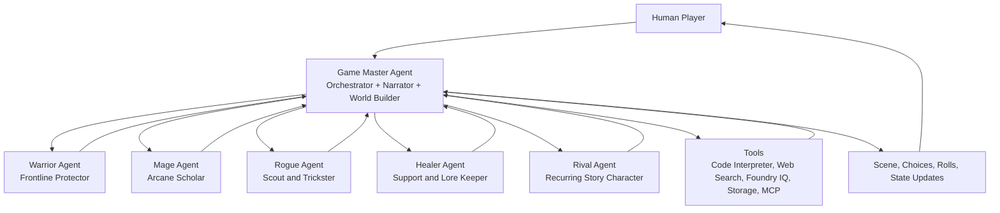

# Reasoning Agents - Starter Kit: Role-Play Game Adventure

**Track**: Battle #2 - Reasoning Agents with Microsoft Foundry

Welcome to the Reasoning Agents track! In this challenge, you'll build a multi-agent system with **Microsoft Foundry** that leverages advanced reasoning capabilities to run an interactive role-play game adventure inspired by tabletop fantasy RPGs.

The goal is to create a system where every agent plays a clear role in the adventure, while a master orchestration agent coordinates the story, rules, character interactions, world state, and player choices.

---

## Prerequisites

Before starting this challenge, ensure you have the following:

### Required Skills

- **Basic Python programming** — variables, functions, classes, and working with APIs
- **Command line familiarity** — navigating directories, running scripts
- **Basic understanding of AI concepts** — what LLMs are, prompts, and responses

### Required Accounts (Free Tiers Available)

| Account | Purpose | Sign Up |
|---------|---------|---------|
| **GitHub** | Version control and submission | [github.com](https://github.com) |
| **Microsoft Azure** | Access to Microsoft Foundry | [azure.microsoft.com/free](https://aka.ms/azure-free-account) |
| **Discord** | Community support | [aka.ms/agentsleague/discord](https://aka.ms/agentsleague/discord) |

### Required Tools

- **Python 3.10+** — [python.org/downloads](https://python.org/downloads)
- **Visual Studio Code** — [code.visualstudio.com](https://code.visualstudio.com)
- **Git** — [git-scm.com](https://git-scm.com)

### Azure Subscription Notes

> [!IMPORTANT]
> Microsoft Foundry requires an Azure subscription. A **free trial** provides $200 credit for 30 days. Some features may incur costs after the trial. Check the [Azure pricing calculator](https://azure.microsoft.com/pricing/calculator/) to estimate costs.

> [!WARNING]
> **Free Tier Limitations:** The Azure free subscription has significant constraints that may prevent full implementation of this challenge:
>
> - **Model access:** Some advanced models may not be available or may have very limited quotas
> - **Rate limits:** Strict API call limits
> - **Region restrictions:** Free tier resources may only be available in limited regions
> - **Feature restrictions:** Some Microsoft Foundry features may require pay-as-you-go
> - **Credit exhaustion:** $200 credit can be consumed quickly with heavy AI model usage
>
> **Recommendation:** For full functionality, consider a **pay-as-you-go** subscription or request access to [Azure for Students](https://azure.microsoft.com/free/students/) or the [Microsoft for Startups Founders Hub](https://www.microsoft.com/startups).

### Time Commitment

- **Setup**: ~1-2 hours
- **Learning basics**: ~4-6 hours
- **Building solution**: ~10-20 hours, depending on complexity

---

## Environment Setup Guidance

### Step 1: Initiate your Project Repository
```bash
# Create a new directory for your project
mkdir <your-unique-project-name>            
cd <your-unique-project-name>
# Initialize a new Git repository
git init
# Create a README file
echo "# Reasoning Agents Challenge" > README.md
# Create a .gitignore file
echo ".venv/" > .gitignore
echo ".env" >> .gitignore
```

### Step 2: Create a Python Virtual Environment

```bash
# Windows
python -m venv .venv
.venv\Scripts\activate

# macOS/Linux
python3 -m venv .venv
source .venv/bin/activate
```

### Step 3: Set Up Azure Credentials

1. Go to [Microsoft Foundry Portal](https://ai.azure.com)
2. Create or select your **AI Project**
3. In your project, go to **Project settings** -> **Project properties**
4. Copy the **Project connection string**
5. Create a `.env` file in this directory:

```env
AZURE_AI_PROJECT_CONNECTION_STRING=your-connection-string-here
AZURE_AI_MODEL_DEPLOYMENT=gpt-4o
```

> [!WARNING]
> Never commit your `.env` file to GitHub.

---

## Project Idea

In this track, you will build a **multi-agent role-play game engine** where a human player enters an interactive fantasy adventure with a party of AI-controlled characters. The system should support storytelling, character decisions, game rules, dice rolls, world state, quests, in-character dialogue, and dynamic consequences.

The experience should feel like a tabletop RPG session: the human player describes what they want to do, the **Game Master agent** narrates and orchestrates the session, and the other agents participate as characters in the story. Each character agent should have its own personality, abilities, goals, and tool access.

### Development Approaches

1. **Local development:** Build and test your custom agentic solution locally with the OSS [Microsoft Agent Framework](https://github.com/microsoft/agent-framework) in Visual Studio Code.
2. **Cloud-based development:** Use [Microsoft Foundry](https://azure.microsoft.com/products/ai-foundry/) to orchestrate your reasoning agents in the Cloud. You can choose either a low-code/no-code approach using the [Foundry UI](https://ai.azure.com), or a code-first approach using the **Foundry Agent Service** within the [Foundry SDK](https://learn.microsoft.com/en-us/azure/ai-foundry/how-to/develop/sdk-overview).

Whatever approach you choose, you are encouraged to:

- Leverage Microsoft Foundry-hosted, GitHub-hosted, or locally-hosted AI models.
- Use visualizations and monitoring tools to track agent performance and interactions.
- Integrate with data sources (Microsoft IQs), APIs, and MCP tools to enhance agent capabilities.
- Implement evaluation and deployment strategies for your multi-agent system.
- Use AI-assisted development tools such as [GitHub Copilot](https://github.com/features/copilot).

---

## Real-world Scenario

The goal of this challenge is to build a **multi-agent fantasy role-play game system** where each agent is an actual player character or story character in the adventure.

The human player starts an adventure by choosing or creating a character, entering a fantasy setting, and making decisions turn by turn. The system should reason over the story context, enforce game rules, manage world state, and coordinate a cast of AI character agents.

The **Game Master agent** is the only non-player orchestrator. It combines the traditional tabletop roles of **master, narrator, and world builder**. It receives player input, determines which character agents should respond or act, applies rules, resolves conflicts, updates the world state, and returns the next scene to the player.

### Suggested Multi-Agent Architecture



### Agent Roles

#### Game Master Agent

The Game Master agent coordinates the full adventure loop and combines three responsibilities in one agent: **master, narrator, and world builder**.

Responsibilities:

- Receives the player input
- Interprets the player's intent
- Determines which character agents should speak, act, or react
- Narrates the scene and describes consequences
- Builds and maintains the world, locations, factions, quests, and secrets
- Applies the game rules and decides when checks or rolls are needed
- Uses tools such as code interpreter, web search, Foundry IQ, storage, and MCP tools
- Updates world state, quest state, party state, and character state
- Resolves conflicts between character agents
- Produces the final scene response for the player
- Decides when to ask for human clarification
- Ensures the experience remains coherent, safe, and playable

Example system behavior:

- If the player says, "I inspect the strange rune on the gate," the Game Master identifies the action, asks the Mage Agent for arcane interpretation, may call Foundry IQ to retrieve lore about the rune, uses code interpreter if a roll is required, and narrates the result.
- If the player says, "I attack the bandit leader," the Game Master asks relevant party members for reactions, resolves initiative or attack rolls, updates health/state, and narrates the combat outcome.

#### Warrior Agent

This character agent plays the role of the party's frontline fighter.

Responsibilities:

- Speaks and acts in character
- Protects the party during danger
- Suggests tactical options in combat
- Tracks martial abilities, weapons, armor, and stamina
- Can request dice rolls for attacks, defense, strength checks, or intimidation
- Reacts emotionally to story events based on its backstory

Example personality:

- Brave, direct, protective, suspicious of magic
- Wants to recover a lost family shield
- Often proposes bold but risky plans

#### Mage Agent

This character agent plays the role of the party's arcane expert.

Responsibilities:

- Speaks and acts in character
- Interprets magical clues, runes, artifacts, and supernatural events
- Suggests spells or magical approaches
- Uses Foundry IQ to retrieve campaign lore about magic, ancient civilizations, prophecies, or planar rules
- Uses web search only for general, public-domain inspiration or factual references when appropriate
- Can request dice rolls for arcana, history, investigation, or spellcasting

Example personality:

- Curious, analytical, slightly arrogant
- Wants to prove that the "myth" of the Starwell is real
- May disagree with the Warrior when brute force risks destroying evidence

#### Rogue Agent

This character agent plays the role of the party's scout, spy, and problem solver.

Responsibilities:

- Speaks and acts in character
- Scouts ahead, searches for traps, unlocks doors, and gathers rumors
- Suggests stealth, deception, and alternative routes
- Uses code interpreter for stealth checks, lockpicking checks, or trap-disarm rolls
- Can query stored world state to remember contacts, debts, secrets, and suspicious NPCs
- Can challenge the Game Master when a plan requires more information before acting

Example personality:

- Witty, skeptical, opportunistic
- Has a mysterious connection to the thieves' guild
- Notices details other characters miss

#### Healer Agent

This character agent plays the role of the party's support specialist and moral compass.

Responsibilities:

- Speaks and acts in character
- Tracks party health, conditions, morale, and rest needs
- Suggests non-violent options, negotiation, and recovery plans
- Uses Foundry IQ to retrieve lore about religions, healing traditions, local customs, and faction history
- Can request dice rolls for medicine, insight, persuasion, or ritual checks
- Helps the Game Master keep consequences understandable and fair

Example personality:

- Compassionate, observant, principled
- Believes the cursed forest can be healed rather than destroyed
- Pushes the party to consider ethical consequences

#### Rival Agent

This character agent plays a recurring story character who may oppose, compete with, or reluctantly help the party.

Responsibilities:

- Speaks and acts in character
- Creates dramatic tension without derailing the game
- Pursues its own goals and secrets
- Can become an antagonist, ally, or rival adventurer depending on player choices
- Uses world state and Foundry IQ lore to stay consistent with the campaign
- Forces the player to reason through negotiation, trust, and consequences

Example personality:

- Charismatic, proud, unpredictable
- Seeks the same relic as the player
- Knows more about the ancient ruins than they admit

### Lightweight Game Rules

The Game Master can implement lightweight RPG mechanics such as:

- Ability checks
- Skill checks
- Attack rolls
- Saving throws
- Inventory constraints
- Health points
- Success, partial success, and failure outcomes
- Character relationships and trust levels
- Quest progress and faction reputation

Example structured roll result:

```json
{
  "actor": "Rogue Agent",
  "check": "Stealth",
  "roll": 17,
  "difficulty": 14,
  "result": "success",
  "consequence": "The Rogue slips past the torchlight and spots a hidden sigil on the gate."
}
```

### Shared State

The Game Master should maintain shared state for the campaign.

Example state:

```json
{
  "campaign": "The Shattered Moon of Eldervale",
  "location": "Moonlit Gate",
  "active_quest": "Find the Starwell Relic",
  "party": [
    {
      "agent": "Warrior Agent",
      "name": "Bran Ironvale",
      "health": 22,
      "inventory": ["longsword", "shield", "torch"]
    },
    {
      "agent": "Mage Agent",
      "name": "Lyra Vey",
      "health": 14,
      "inventory": ["spellbook", "crystal focus"]
    }
  ],
  "world_flags": {
    "gate_sigil_discovered": true,
    "rival_trust_level": "uncertain"
  }
}
```

---

## Example Adventure Flow

1. The player enters a prompt:

   > "I enter the ruined chapel and search for clues."

2. The **Game Master Agent** interprets the action, identifies that this is a search/investigation scene, and checks current world state.

3. The Game Master asks the character agents to participate:

   - The **Rogue Agent** checks for traps and hidden compartments.
   - The **Mage Agent** examines magical residue.
   - The **Healer Agent** looks for religious symbols or signs of corruption.
   - The **Warrior Agent** stands guard.

4. The Game Master uses **code interpreter** to roll the required checks.

5. The Game Master queries **Foundry IQ** for world lore about the chapel, the Moonlit Gate, and the Starwell relic.

6. The Game Master optionally uses **web search** for general public-domain inspiration, such as medieval chapel architecture or folklore motifs.

7. The Game Master updates the shared campaign state.

8. The Game Master returns the final response:

   > "You brush aside a layer of ash from the altar and uncover a silver sigil shaped like an eye. Your roll succeeds, so you also notice that the sigil matches the symbol on the missing wizard's journal."

---

## Suggested Features

Your solution can include any of the following:

- Character creation
- Dynamic quest generation
- Turn-based adventure loop
- AI character conversations
- Party banter and disagreement
- Dice rolling
- Combat encounters
- Inventory management
- Quest journal
- World memory
- Player choices with consequences
- Map or location graph
- Human-in-the-loop confirmation for major irreversible actions
- Telemetry dashboard showing agent calls and reasoning flow
- Evaluation set for testing story consistency and rule correctness
- Foundry IQ-backed world lore and campaign knowledge

---

## Recommended Tool Integrations

You may enhance your system with tools, APIs, MCP servers, and Foundry-native capabilities. The most useful pattern is to give the **Game Master Agent** access to orchestration-level tools, then give character agents limited tool access based on their in-story role.

### Specific tool examples

- **Code interpreter**: roll dice, calculate modifiers, resolve combat math, simulate initiative order, randomize encounters, generate loot tables, and validate state updates.
- **Web search**: retrieve public information for inspiration, such as medieval architecture, public-domain mythology, historical weapons, map references, weather, or folklore motifs.
- **Foundry IQ and Vector Search**: ground the adventure in campaign-specific knowledge, such as world lore, maps, factions, character backstories, magical rules, quest history, and previous session notes.
- **Image generation**: create portraits, monsters, artifacts, maps, or location concept art for the demo.
- **MCP dice roller server**: expose dice rolling as a reusable tool for the Game Master and character agents.
- **[Memory](https://learn.microsoft.com/azure/foundry/agents/how-to/memory-usage?pivots=python) in Foundry Agent Service**: store and retrieve long-running campaign state, persist character sheets, inventory, health, conditions, quest progress, faction reputation, and world flags.
- **Calendar/reminder integration**: schedule recurring campaign sessions or reminders for team hackathon demos.

### Required Foundry IQ integration

Integrate **Foundry IQ** as the source of truth for the world in which the characters live. Instead of asking the model to invent or remember every detail, store structured and unstructured campaign knowledge in IQ and let the Game Master retrieve it when needed.

Recommended IQ data:

- World overview: kingdoms, regions, geography, laws of magic
- Factions: goals, leaders, alliances, enemies, secrets
- Locations: cities, ruins, temples, dungeons, roads, safe havens
- Character backstories: player character, Warrior, Mage, Rogue, Healer, Rival
- Quest history: active quests, completed quests, failed quests, unresolved clues
- Session notes: important decisions, consequences, discovered lore
- Homebrew rules: simplified combat, spellcasting, rests, inventory, leveling
- Bestiary: monsters, weaknesses, behaviors, encounter difficulty
- Artifacts: relics, curses, magical items, ownership history

Example use:

1. The player asks about the Moonlit Gate.
2. The Game Master queries Foundry IQ for "Moonlit Gate", "Starwell Relic", and current location.
3. Foundry IQ returns relevant lore: the gate opens only when three party members speak conflicting truths.
4. The Game Master asks the character agents to react in character.
5. The Game Master narrates the scene and offers the player choices.

### Creating synthetic data for Foundry IQ

Use **synthetic campaign data** to feed Foundry IQ. Synthetic data keeps the demo safe, avoids private or copyrighted content, and gives the Game Master a consistent knowledge base for retrieval.

Use original names, places, factions, rules, and quests. Do not copy protected campaign settings, published adventures, fictional characters, or proprietary lore.

#### Suggested synthetic data set

Create a small but complete world pack with the following files:

| File | Purpose | Example contents |
|------|---------|------------------|
| `world_overview.md` | High-level setting context | Kingdoms, geography, tone, laws of magic, calendar |
| `locations.md` | Places the party can visit | Villages, ruins, forests, temples, dungeons, roads |
| `factions.md` | Groups with motivations | Guilds, cults, royal houses, rebel groups, monster clans |
| `characters.md` | Character and NPC profiles | Warrior, Mage, Rogue, Healer, Rival, merchants, villains |
| `quests.md` | Main quest and side quests | Objectives, clues, blockers, rewards, failure consequences |
| `items_and_artifacts.md` | Important objects | Relics, weapons, potions, cursed items, keys |
| `bestiary.md` | Monsters and encounters | Creature behavior, weaknesses, difficulty, loot |
| `homebrew_rules.md` | Game mechanics | Dice checks, combat rules, rests, spell limits, leveling |
| `session_notes.md` | Running campaign memory | Decisions, discovered clues, state changes, unresolved threads |

#### Minimum viable Foundry IQ data pack

For a short hackathon demo, start with 8-10 synthetic records:

1. **World summary**: one page describing the realm and its central conflict.
2. **Starting location**: one village, tavern, forest, ruin, or dungeon entrance.
3. **Main quest**: one objective with three clues and one twist.
4. **Party profiles**: one short profile for each AI character agent.
5. **Rival profile**: one recurring character with a secret motivation.
6. **Faction profile**: one ally faction and one opposing faction.
7. **Artifact profile**: one magical item tied to the quest.
8. **Monster profile**: one encounter with strengths and weaknesses.
9. **Homebrew rules**: simple checks, combat, health, and inventory rules.
10. **Session state template**: JSON or Markdown template for tracking what changed.

#### Example synthetic record

```markdown
# Location: The Moonlit Gate

Type: Ancient ruin
Region: Northern Eldervale

Summary:
The Moonlit Gate is a silver stone archway buried in a ruined chapel. It opens only under moonlight when three conflicting truths are spoken by three different travelers.

Known clues:
- The gate symbol matches the eye-shaped sigil in the missing wizard's journal.
- The Healer's order believes the gate was once used for peaceful pilgrimages.
- The Rival claims the gate leads to a vault, but may be hiding its real purpose.

Secrets:
- The gate does not open to a vault. It opens to a memory of the kingdom before the moon shattered.
- Opening the gate without the Starwell Relic summons a guardian.

Related entities:
- Starwell Relic
- Order of the Silver Root
- Rival Agent: Kael Thorn
```

#### Synthetic data generation prompt

You can ask an AI assistant to generate a first draft of your world pack. Use a prompt like this:

```text
Create original synthetic data for a fantasy role-play game knowledge base.
Do not use copyrighted campaign settings, published characters, or proprietary lore.

Generate:
- 1 world overview
- 5 locations
- 3 factions
- 5 character profiles
- 3 quests
- 5 artifacts
- 5 monsters
- 1 lightweight homebrew rules document

Keep each entry concise, internally consistent, and easy to retrieve with semantic search.
Use Markdown headings, tags, secrets, known facts, and related entities.
```

#### Quality checklist before uploading to Foundry IQ

- **Originality**: all names, places, factions, and quests are original.
- **Safety**: no private data, credentials, customer data, or sensitive information.
- **Consistency**: the same names and locations are spelled the same way everywhere.
- **Retrievability**: each record has clear headings, tags, summaries, and related entities.
- **Separation of player-known and secret knowledge**: mark what players know vs. what only the Game Master should know.
- **Small chunks**: split large lore documents into focused sections so IQ can retrieve precise context.
- **State tracking**: keep mutable session state separate from static world lore.

#### Recommended retrieval pattern

At runtime, the Game Master should query Foundry IQ before narrating important scenes:

1. Retrieve static lore for the current location, faction, artifact, or NPC.
2. Retrieve character backstories for any character agents involved in the scene.
3. Retrieve current session notes or state summaries.
4. Combine retrieved context with the player's action.
5. Ask character agents to respond in character.
6. Narrate the outcome and update session state.

---

## Quick Start

Get started quickly by exploring the following resources that provide step-by-step guidance for building custom agents.

### Build your first agent with Microsoft Foundry UI

Learn how to set up your Microsoft Foundry project and prototype your first agent with a low-code approach using the Microsoft Foundry UI.

Microsoft Foundry quick starter: [https://learn.microsoft.com/training/modules/ai-agent-fundamentals/](https://learn.microsoft.com/training/modules/ai-agent-fundamentals/)

### Build your first agent with Microsoft Foundry Python SDK

Learn how to build your first custom agent and equip it with knowledge and tools using Microsoft Foundry Agent Service.

Build a Pizza Ordering Agent with Microsoft Foundry and MCP: [https://jolly-field-035345f1e.2.azurestaticapps.net/](https://jolly-field-035345f1e.2.azurestaticapps.net/)

### Build a multi-agent workflow with Microsoft Foundry

Learn how to orchestrate multiple agents into a declarative or hosted workflow using Microsoft Foundry.

Build a workflow in Microsoft Foundry: [https://learn.microsoft.com/azure/ai-foundry/agents/concepts/workflow?view=foundry](https://learn.microsoft.com/azure/ai-foundry/agents/concepts/workflow?view=foundry)

### Build and orchestrate agents locally with Microsoft Agent Framework

Follow tutorials to build custom agents and orchestrate them through multi-agent workflows.

Microsoft Agent Framework tutorials: [https://learn.microsoft.com/agent-framework/tutorials/overview](https://learn.microsoft.com/agent-framework/tutorials/overview)

---

## Reasoning Patterns & Best Practices

When designing your reasoning agents and multi-agent workflows, consider applying well-established reasoning patterns and agentic best practices.

### Common reasoning patterns to explore include:

1. **Planner-Executor:** Separate agents responsible for planning and execution.
2. **Critic / Verifier:** Introduce an agent that reviews outputs, checks assumptions, and validates reasoning.
3. **Self-reflection & Iteration:** Allow agents to reflect on intermediate results and refine their approach.
4. **Role-based specialization:** Assign clear responsibilities to each agent to reduce overlap and improve reasoning quality.

### Best practices for building with Microsoft Foundry:

1. Use **telemetry**, logs, and visual workflows in Foundry to understand how agents reason and collaborate.
2. Apply **evaluation** strategies such as test cases, scoring rubrics, or human-in-the-loop reviews.
3. Build with **Responsible AI** principles in mind at both application and data layers.

---

## Security & Disclaimer

### Important: Protect Confidential Information

Before submitting your project, please read the repository disclaimer. This is a public repository accessible worldwide.

#### What You Must NOT Include:

- Azure API keys, connection strings, or credentials
- Customer data or personally identifiable information
- Confidential or proprietary company information
- Internal engineering projects not approved for open source
- Pre-release product information under NDA
- Trade secrets or proprietary algorithms

#### Azure-Specific Security Best Practices:

**Never commit `.env` files**

```bash
AZURE_AI_PROJECT_CONNECTION_STRING=your-connection-string
AZURE_OPENAI_API_KEY=your-api-key
AZURE_SUBSCRIPTION_ID=your-subscription-id
```

**Use Azure Key Vault** for production apps.

**Enable Managed Identities** to authenticate without storing credentials.

**Review `.gitignore`** and include:

```gitignore
.env
.env.*
.azure/
**/.secrets/
config/secrets.*
*.pem
*.key
```

**Use demo data only**

**Scan for secrets** before pushing:

```bash
git secrets --scan
```

#### Responsible AI Considerations

When building reasoning agents:

- **Implement guardrails** to validate inputs and outputs
- **Add content filters** where appropriate
- **Test for bias and unsafe behavior**
- **Provide transparency** that users are interacting with AI
- **Enable human oversight** for critical decisions

For a role-play game, also consider:

- Avoid generating graphic, hateful, or explicit content
- Allow players to set tone and safety boundaries
- Keep player-facing consequences fictional and age-appropriate
- Avoid copyrighted campaign settings, characters, or protected storylines unless properly licensed
- Use original fantasy worlds, characters, and quests

---

## Requirements & Evaluation

### Submission Requirements

To be considered valid, your solution must:

- Implement a **multi-agent system** aligned with the **role-play game challenge scenario**.
- Use **Microsoft Foundry** and/or the **Microsoft Agent Framework** for agent development and orchestration.
- Demonstrate **reasoning** and multi-step decision-making across agents.
- Include a **Game Master agent** that combines the roles of orchestrator, narrator, and world builder.
- Assign every other agent a clear in-story character role, such as Warrior, Mage, Rogue, Healer, Rival, or another character archetype.
- Integrate with **external tools**, APIs, and/or MCP servers where useful, such as code interpreter for dice rolls, web search for public inspiration, storage for character state, quest logs, memory, maps, or evaluations.
- Include a recommended **Foundry IQ** integration for campaign knowledge, such as world lore, character backstories, factions, quest history, magical rules, and session notes.
- Be **demoable** live or recorded.
- Include clear documentation describing:
  - Agent roles and responsibilities
  - Reasoning flow and orchestration logic
  - Game loop
  - Tools, APIs, MCP integrations, and Foundry IQ usage
  - State management approach

> [!NOTE]
> Your solution must align with the challenge scenario, but you are not required to follow the suggested architecture exactly. You are free to design a different agent composition, workflow structure, or reasoning strategy as long as the system delivers an interactive role-play game experience.

Optional — but highly valued:

- Use of **evaluations**, **telemetry**, or **monitoring**
- Advanced reasoning patterns such as planner-executor, critics, and reflection loops
- Responsible AI guardrails
- Persistent world memory backed by Foundry IQ or another retrieval layer
- Player character progression
- In-character agent dialogue and party dynamics
- Creative gameplay mechanics
- Strong demo storytelling

### Evaluation Criteria

Submissions will be scored using the following weighted criteria:

| Criterion | Impact |
|-----------|--------|
| **Accuracy & Relevance** | **25%** — Solution meets challenge requirements, aligns with the scenario, and produces correct, relevant outputs |
| **Reasoning & Multi-step Thinking** | **25%** — Clear problem decomposition, structured reasoning, and effective agent collaboration |
| **Creativity & Originality** | **15%** — Novel ideas, unique agent roles, or unexpected but effective execution |
| **User Experience & Presentation** | **15%** — Polished, clear, and demoable experience with understandable workflows |
| **Reliability & Safety** | **20%** — Robust agent patterns, safe tool/API/MCP usage, and avoidance of common pitfalls |

---

## Glossary

| Term | Definition |
|------|------------|
| **Agent** | An AI system that can perceive context, make decisions, and take actions to achieve goals |
| **Multi-agent system** | Multiple AI agents working together, each with specialized roles |
| **Orchestration** | Coordinating multiple agents through a defined workflow |
| **Game Master** | The main coordinating agent that acts as orchestrator, narrator, rules guide, and world builder |
| **LLM** | Large Language Model, such as GPT-style models |
| **Prompt** | The input or instruction given to an AI model |
| **MCP** | Model Context Protocol, a standard for connecting AI models to tools and data sources |
| **Reasoning** | The ability to break down problems, think step by step, and arrive at logical conclusions |
| **Tool calling** | An agent's ability to use external tools or APIs |
| **Workflow** | A defined sequence of agent interactions |
| **Telemetry** | Data collected about agent behavior and performance |
| **Guardrails** | Safety mechanisms that prevent harmful or incorrect outputs |
| **Human-in-the-loop** | A pattern where human approval is required at certain points |
| **Evaluation** | Testing and measuring agent performance |
| **Foundry** | Microsoft's cloud platform for building, deploying, and managing AI applications and agents |

---

## Troubleshooting

| Issue | Solution |
|-------|----------|
| `ModuleNotFoundError: No module named 'azure'` | Run `pip install -r requirements.txt` in your activated virtual environment |
| `AuthenticationError` | Verify your API key or connection string in `.env` |
| `Connection refused` errors | Check your Azure endpoint URL and internet connection |
| `RateLimitError` | Wait a few minutes or check Azure quotas |
| Python command not found | Ensure Python is installed and added to your PATH |
| Virtual environment not activating | On Windows, run `Set-ExecutionPolicy -Scope CurrentUser -ExecutionPolicy RemoteSigned` if needed |
| Agents contradict each other | Centralize final decisions in the Game Master agent and store authoritative state |
| Game state gets lost | Store character, inventory, quest, and world state in structured JSON, a database, or Foundry IQ-backed knowledge |
| Responses are too long | Add response length guidance to the Game Master prompt |

---

## Resources

- **Microsoft Foundry Documentation**: [https://learn.microsoft.com/azure/ai-foundry/](https://learn.microsoft.com/azure/ai-foundry/)
- **Microsoft Foundry Agent Service Overview**: [https://learn.microsoft.com/en-us/azure/ai-foundry/agents/overview](https://learn.microsoft.com/en-us/azure/ai-foundry/agents/overview)
- **Microsoft Agent Framework Documentation**: [https://learn.microsoft.com/agent-framework/](https://learn.microsoft.com/agent-framework/)
- **Microsoft Agent Framework GitHub Repository**: [https://github.com/microsoft/agent-framework](https://github.com/microsoft/agent-framework)
- **GitHub Copilot**: [https://github.com/features/copilot](https://github.com/features/copilot)
- **Model Context Protocol**: [https://modelcontextprotocol.io/](https://modelcontextprotocol.io/)
- **Microsoft Foundry Portal**: [https://ai.azure.com](https://ai.azure.com)

---

## Final Challenge Prompt

Build a multi-agent fantasy role-play game where the human player explores a world alongside AI character agents, solves quests, and faces consequences.

Your system should include:

- A **Game Master agent** that acts as orchestrator, narrator, and world builder
- Multiple specialized **character agents** that act as players or story characters
- A clear reasoning flow
- Persistent game state
- Recommended Foundry IQ integration for campaign/world knowledge
- Concrete tools such as code interpreter for dice rolls and web search for public inspiration
- Meaningful player choices
- Safe and responsible outputs
- A demo that shows agents collaborating to create an engaging adventure

May your agents be wise, your rolls dramatic, and your orchestrator always keep the party together.
