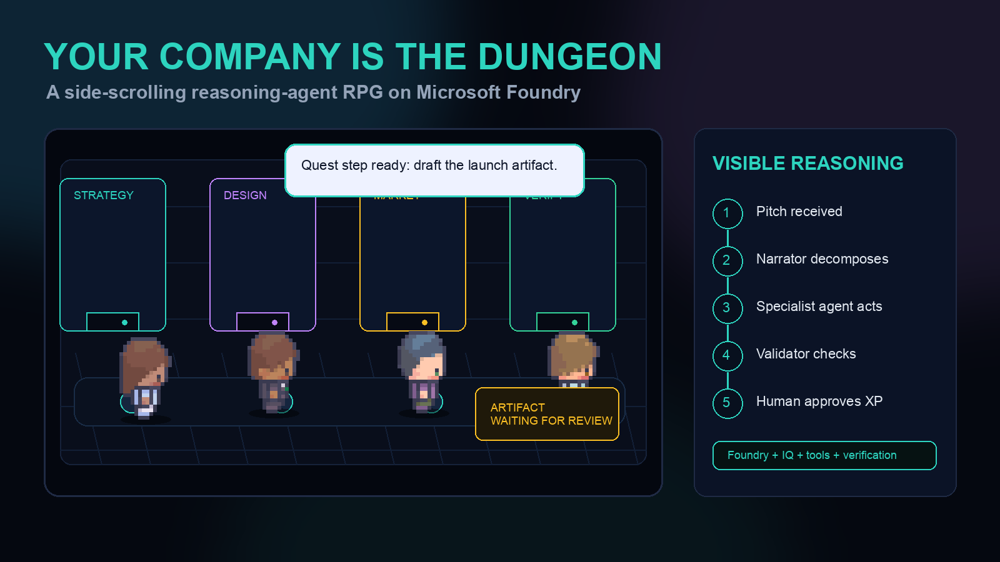
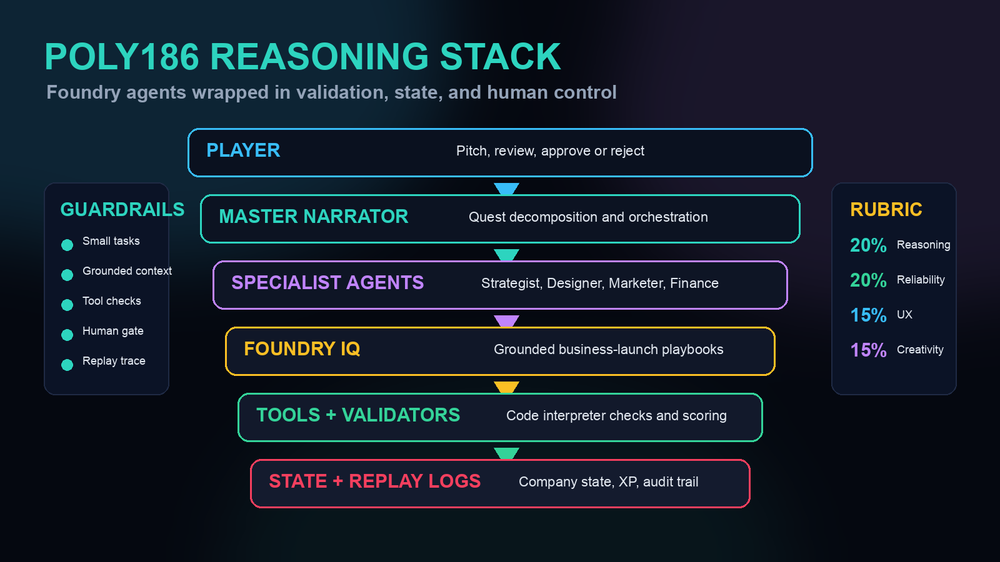
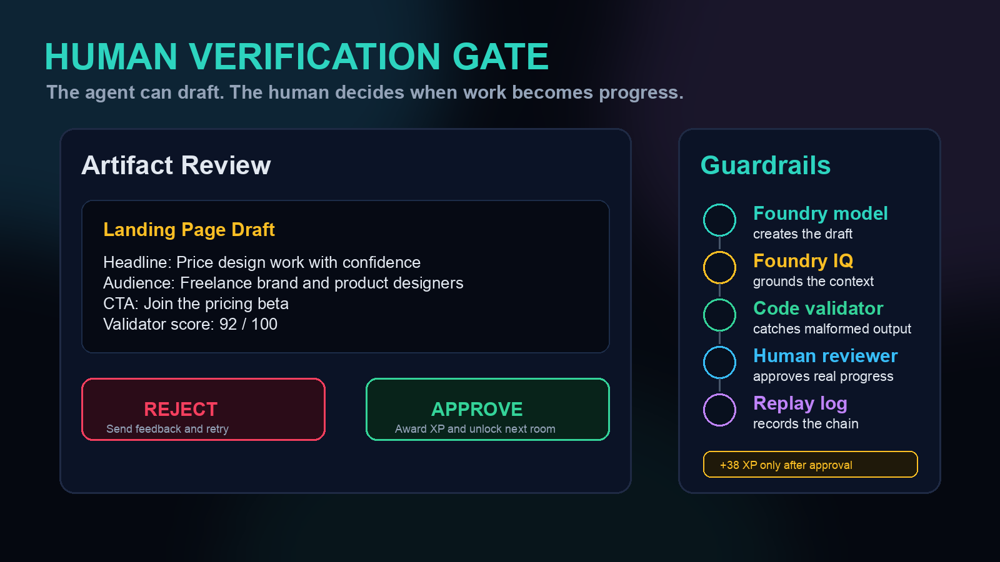

# Building an Agent That Plays to Win: Inside the Poly186 Reasoning Stack on Microsoft Foundry

Author: Princeps Polycap  
Target publication: Microsoft Tech Community / Educated Developer Blog  
Draft deadline: June 5, 2026  
Event CTA: https://developer.microsoft.com/en-us/reactor/events/26942/

## Editor Notes

Paste this into the Tech Community WYSIWYG editor after signing in. Upload the prepared images with the editor camera icon if the rich paste does not carry images through automatically, then delete this section before publishing.

Images prepared for upload:

1. `submission/blogs/images/poly186-game-loop.png`
2. `submission/blogs/images/poly186-reasoning-stack.png`
3. `submission/blogs/images/poly186-verification-gate.png`

Suggested tags:

Microsoft Foundry, Agents League, Reasoning Agents, Multi-Agent Systems, AI Agents, Developer Tools

---

# Building an Agent That Plays to Win: Inside the Poly186 Reasoning Stack on Microsoft Foundry

Most agent demos ask the user to trust a chat window.

For our Microsoft Agents League build, we wanted the opposite: a reasoning system you can watch, challenge, and approve step by step. So we turned a business launch workflow into a side-scrolling RPG.

The project is called **Your Company Is the Dungeon**.

The player enters a business idea. A Master Narrator agent turns that idea into a quest line. Specialist agents join as party members: a Strategist for positioning, a Designer for landing pages, a Marketer for launch copy, and a Finance agent for pricing and projections. Each room in the dungeon is a stage of company-building work. Each agent produces a real artifact. The player must approve it before the system awards XP and unlocks the next room.

It is playful on purpose. But underneath the game layer is a serious Microsoft Foundry architecture: multi-agent orchestration, grounded retrieval, deterministic tool checks, shared state, replay logs, and human verification gates.

Caption: "Your Company Is the Dungeon" turns a startup workflow into a playable reasoning loop.

## Why Build a Business Workflow as an RPG?

Because games are good at making state visible.

In many agent products, the user submits a prompt and waits for a final answer. If the answer is good, the demo looks magical. If the answer is wrong, the user has very little evidence about where the system failed.

An RPG gives us a better interaction model.

A Game Master decomposes the mission. Party members take turns. The world has shared state. Tools resolve outcomes. The player makes decisions at meaningful checkpoints. Progress is visible: locked room, active room, cleared room, reward.

That pattern maps cleanly to multi-step reasoning agents:

| RPG pattern | Poly186 implementation |
| --- | --- |
| Game Master | Master Narrator agent |
| Party members | Strategist, Designer, Marketer, Finance |
| Campaign lore | Foundry IQ business playbooks |
| Dice and combat rules | Code interpreter validators |
| Character turns | Bounded agent tasks |
| Campaign state | Company, quest, artifact, and XP state |
| Player choice | Human verification gate |

The fantasy layer makes the workflow memorable. The architecture makes it reliable.

## The Core Loop

The live demo starts with a founder pitch, for example:

> "An AI tool that helps freelance designers price their projects."

The Master Narrator turns that pitch into a short quest line:

1. Define the target customer and positioning.
2. Draft the landing page structure.
3. Write a first launch email.
4. Validate each artifact.
5. Ask the human to approve or reject.

The static reasoning stack below is the version we use when explaining the architecture without depending on a live browser state.

The important design choice is that the model is not the whole product. The model reasons, but the application controls the loop: what context is retrieved, which tool is called, what gets validated, what is logged, and when a human must decide.

Caption: The reasoning stack separates orchestration, specialist work, retrieval, validation, state, and replay logs.

## The Master Narrator: Orchestrator, Not Chatbot

The Master Narrator is responsible for turning vague intent into playable structure.

It does not try to complete the whole business plan in one response. It breaks the job into bounded steps, assigns the right specialist agent, and updates shared state after each outcome.

That separation matters. A single large prompt can produce an impressive wall of text, but it is hard to inspect, hard to retry, and hard to validate. A quest line gives us smaller units of work:

| Quest step | Responsible agent | Artifact |
| --- | --- | --- |
| Position the product | Strategist | ICP and positioning brief |
| Shape the page | Designer | Landing page outline |
| Launch the first ask | Marketer | Signup email |
| Price the offer | Finance | Pricing assumptions |

The Narrator also keeps the story coherent for the user. When the Strategist finishes, the Designer does not start from scratch. The Designer sees the company state, the approved positioning, and the active quest objective.

That is the difference between "several agents in a room" and orchestration.

## Specialist Agents with Narrow Jobs

Each specialist agent has a deliberately narrow responsibility.

The Strategist owns customer, pain, promise, and differentiation.

The Designer owns page structure, hierarchy, call to action, and artifact presentation.

The Marketer owns launch copy, audience framing, subject line, and conversion goal.

Finance owns pricing logic, rough assumptions, and economic sanity checks.

This matters because permissions and evaluation should follow responsibility. The Marketer should not deploy pages. The Designer should not silently rewrite the target customer. Finance should not invent market data without tagging assumptions.

In practice, scoped agents are easier to test, easier to replay, and easier for users to understand.

## Foundry IQ Grounds the Party

For this battle, all reasoning agents run on Microsoft Foundry model deployments. Foundry IQ acts as the knowledge layer for business launch context: positioning frameworks, first-customer playbooks, landing page heuristics, pricing notes, and launch copy patterns.

That gives the agents something better than memory and confidence. It gives them retrievable context.

When the Strategist recommends a narrow beachhead customer, the system can show the playbook context that shaped the recommendation. When the Designer chooses a landing page structure, the reasoning panel can show whether that came from the approved positioning, a retrieved pattern, or an explicit assumption.

That distinction is useful in a live demo. In production, it is a trust requirement.

## Code Interpreter as the Rules Engine

The code interpreter layer plays the role that dice and combat rules play in tabletop games: it resolves things that should not be left to vibes.

For this build, deterministic validators check artifacts before the human sees them.

Examples:

| Artifact | Validator checks |
| --- | --- |
| Positioning brief | Required fields, customer specificity, value proposition shape |
| Landing page | Required sections, call-to-action presence, generated URL status |
| Launch email | Subject length, body length, CTA, obvious formatting issues |
| Pricing notes | Missing assumptions, inconsistent ranges, invalid numbers |

The validator is not the judge of taste. It is the first line of defense against malformed output.

The human remains the final reviewer.

That gives us a layered reliability model:

1. Foundry model reasons.
2. Foundry IQ grounds.
3. Tools execute.
4. Validators check structure.
5. Human approves impact.
6. Replay log records the chain.

Caption: XP is awarded only after deterministic validation and human approval.

## The Verification Gate Is the Safety Story

The verification gate started as a game mechanic. It became the central product pattern.

Agents are probabilistic. Business actions are not. A generated email, landing page, pricing recommendation, or customer segment should not become "done" just because a model produced fluent output.

So every consequential artifact stops at a gate.

The user can approve it, reject it, or inspect the reasoning trail before deciding. If the artifact is rejected, the quest can retry with the failure reason in state. If it is approved, the system awards XP and moves forward.

That is more than UX polish. It is how we make the system controllable.

For developers building with agents, this pattern is reusable: use the model for creative and analytical work, use deterministic tools for checks, and keep the human in charge of consequential transitions.

## What We Learned Tuning for a Live Battle

The live battle forced us to care about things that do not show up in architecture diagrams.

One early version completed the whole quest server-side. The logs looked good. The artifacts were generated. The state updated correctly.

The demo still felt broken.

Why? Because the player did not visibly move through the rooms. The audience could not see the handoffs. The agent work happened, but the experience skipped the story.

We changed the runtime loop so the client advances chapter by chapter:

1. Create the world.
2. Pick the next runnable chapter.
3. Move the player to the right room.
4. Execute one agent task.
5. Update the HUD, artifact panel, reasoning log, and XP.
6. Continue.

That made the system more legible. The audience can see the Strategist finish, watch the Designer activate, and inspect the reasoning panel as tool events arrive.

We also hit a browser timing issue that only matters in real demos: animation callbacks can pause in hidden or backgrounded tabs. If an autoplay loop waits forever for a tween completion event, the demo stalls. We added wall-clock fallbacks that snap the player to the target and keep the workflow moving.

Small reliability details matter when the agent is live, visible, and timed.

## Progressive Enhancement for the Game Layer

The repo has to be forkable. That means the reasoning path cannot depend on private credentials, private services, or protected art assets.

The game uses procedural fallback characters by default. If local pixel-art sprites exist on disk, the game loads them. If they are missing, Phaser draws simple characters and the demo still runs.

That choice sounds cosmetic, but it reflects a broader architecture principle:

1. The public repo should run after clone.
2. The local maintainer experience can be enhanced.
3. Optional assets should never break the reasoning system.

The same principle applies to cloud calls. The demo has simulation fallbacks so local developers can inspect the loop without Azure credentials, while the live path can still use Microsoft Foundry deployments.

## Replay Logs Make Reasoning Auditable

Every important step emits a replay event:

1. Pitch received.
2. Quest decomposed.
3. Agent selected.
4. Knowledge retrieved.
5. Tool called.
6. Artifact generated.
7. Validator result recorded.
8. Human decision captured.
9. XP awarded.

The replay log serves three audiences.

Developers use it to debug.

Judges use it to see that real reasoning and tool use happened.

Users use it to understand why the system asked them to approve an artifact.

For agent products, replay logs are not just observability. They are part of the trust surface.

## What Developers Can Reuse

You do not need a dungeon theme to reuse this architecture.

The transferable pattern is:

1. Accept user intent.
2. Decompose it with an orchestrator.
3. Assign scoped specialist agents.
4. Ground each step with retrieval.
5. Execute tools for deterministic work.
6. Validate outputs before review.
7. Require human approval for consequential state changes.
8. Save replay events for debugging and trust.

That pattern works for business onboarding, sales workflows, customer success, internal operations, education, and many other domains where agents need to do multi-step work without becoming black boxes.

The RPG just makes the control loop obvious.

## What We Are Showing on June 10

On June 10, 2026, we will show **Your Company Is the Dungeon** during **Agents League: Reasoning Agents Battle** on Microsoft Reactor.

The live flow:

1. Open the side-scrolling game.
2. Enter a startup pitch.
3. Watch the Master Narrator create a quest line.
4. Let specialist agents produce real artifacts.
5. Approve or reject the artifacts at verification gates.
6. Inspect the replay log and code.
7. Show how developers can fork the repo and author new quests.

The point is not that agents are magic. The point is that agent systems can be observable, bounded, and fun to use.

## Join the Battle

Join us for **Agents League: Reasoning Agents Battle** on June 10, 2026 at Microsoft Reactor.

Register here: https://developer.microsoft.com/en-us/reactor/events/26942/

If you are building with Microsoft Foundry, bring the hard question: how do we move from clever prototypes to agent systems people can trust?

That is the dungeon we are trying to clear.
