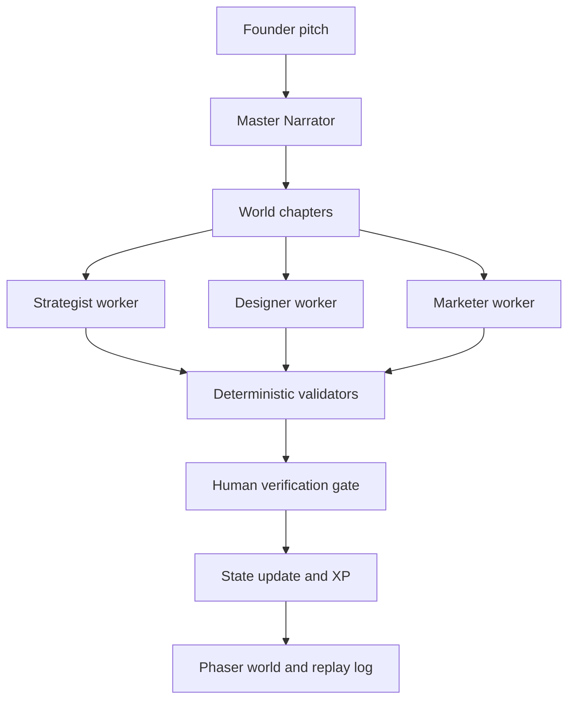

# What We Learned Building "Your Company Is the Dungeon"

Author: Agents League build log  
Published: May 2026

This is the technical post we wish we had before starting this project.

We built a playable, multi-agent startup simulator for Microsoft Agents League Battle #2. The user enters a startup pitch, a Master Narrator decomposes it into chapters, specialist agents generate artifacts, deterministic validators score output, and a human verification gate controls XP progression.

The system works. But we learned the hard way that "works" is not enough. If you are building agent products for developers, reliability and visible reasoning matter as much as model quality.

## Why this post exists

Most "agent demo" writeups stop at architecture diagrams and happy-path screenshots. We wanted a developer-focused record of:

1. What we built
2. Why specific choices were made
3. What failed first
4. How we fixed it
5. What we would do differently in a second build

## The system in one page

The product loop looks like this:

Core layers:

- Reasoning and orchestration: Microsoft Foundry agents
- Validation and scoring: deterministic code interpreter wrappers
- State and API: FastAPI + Pydantic
- Runtime UX: Phaser 3

## Lesson 1: Forkability is a feature, not a constraint

We treated forkability as a hard requirement. That forced useful discipline:

- Simulation mode always available without cloud credentials
- No secrets in repository
- No private model identifiers exposed in UI logs
- Fallback visuals when local sprite assets are missing

This gave us reproducible demos and safer collaboration. It also reduced the "works on my machine" gap before live runs.

## Lesson 2: A fast backend is not the same as a good game loop

One of our biggest failures looked like success in logs.

Initial implementation ran full autoplay server-side in one call. The backend finished all chapters correctly. But on the client, the player did not visibly move through rooms and chapter transitions were not observable.

From a user perspective, the feature was broken.

### What changed

We replaced one-shot autoplay with a visible client loop:

1. Design world once
2. Pick next runnable chapter
3. Move player to chapter room
4. Execute one chapter
5. Update HUD, logs, and world state
6. Repeat

This made model reasoning legible as gameplay. It also exposed intermediate failure states that were invisible before.

## Lesson 3: Browser timing can deadlock animation workflows

We hit a subtle bug where autoplay could stall forever.

Cause:

- Movement awaited Phaser tween completion
- Hidden or backgrounded tabs can pause animation timing
- Completion callback never fired

Fix:

- Added wall-clock fallback timeout around movement tweens
- On timeout, snap to target and resolve promise

This is a small code change with a large reliability impact for demos and streamed sessions.

## Lesson 4: Sanitize telemetry early

We found private deployment names leaking into visible reasoning traces through invocation metadata. This is risky in public demos and repositories.

Fix:

- Keep real deployment details in backend execution path
- Emit sanitized labels in UI-facing replay events
- Use explicit simulation labels in DEMO mode

Rule of thumb: treat every replay log as potentially public by default.

## Lesson 5: Side panels can kill immersion

Our first UI was technically informative but felt flat. Quest Path, Artifact Reader, and Reasoning Trace lived as static panels around the canvas.

What improved game feel:

- Expanded stage to primary surface
- Hid legacy sidebar during active gameplay
- Added in-world run map HUD
- Added clickable dossier terminals near rooms
- Kept deep data in character overlays

Same information, better interaction model.

## Lesson 6: Diegetic UI helps reasoning products feel alive

We introduced in-world signals that align data with scene context:

- Room status badges (LOCKED, ACTIVE, CLEARED)
- Corridor checkpoints and gate break effects
- Pedestal artifact states (empty, scroll, trophy)
- Focus rings and speech bubbles
- Launch ceremony on full completion

Developers could still inspect the same state, but now progression reads at a glance without parsing logs first.

## Lesson 7: Verification gates are your reliability narrative

We enforced a human verification gate before XP awards. This was more than UX; it is a product safety pattern.

Why it matters:

- Agent output quality varies by task
- Deterministic scoring catches format and consistency issues
- Human approval catches contextual judgment errors

For developer audiences, this pattern is often more compelling than pure model benchmark numbers.

## What we validated repeatedly

We used a repeatable validation stack on every iteration:

1. Static checks: Python compile and JS syntax check
2. API simulation tests: state init + full autoplay completion
3. Browser runs: fresh state, visual autoplay, completion reset
4. Safety scans: grep for leaked internal endpoints/model identifiers

This kept velocity high while reducing regressions during rapid UX changes.

## Architecture decisions we are keeping

1. State-first design with clear `CompanyState` and world chapter structure
2. Progressive enhancement for art assets (procedural fallback remains playable)
3. Visible replay logs as first-class product feature
4. Deterministic validators as guardrails around agent creativity
5. Simulation-first local developer workflow

## Things we would improve next

1. Add branching chapter outcomes so choices affect downstream tasks
2. Add explicit failure recovery paths, not just pass/fail chapter statuses
3. Expand role set beyond three specialists for enterprise scenarios
4. Add richer observability exports for offline evaluation dashboards
5. Add scene-level audio and pacing cues tied to reasoning events

## Practical takeaways for developers

If you are building agent applications, these habits paid off most:

1. Make every async visual flow resilient to hidden-tab timing
2. Keep public telemetry sanitized from day one
3. Treat local simulation as mandatory infrastructure
4. Separate reasoning quality from presentation quality, then improve both
5. Show intermediate agent steps, not only final artifacts

## Final thought

The most important shift in this project was mindset.

We stopped asking "does the agent finish the task?" and started asking "can a human follow, trust, and verify how it finished?"

That question improved architecture, UI, testing strategy, and demo reliability at the same time.

If you are preparing a live agent demo, prioritize legibility over novelty. A clear, observable system beats a flashy black box every time.
