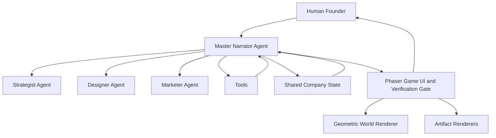

# Architecture

## Core Pattern

The implementation follows the official RPG live-battle architecture and reskins it for business creation.



## Agent Responsibilities

| Agent | Role | Foundry Requirement |
|---|---|---|
| Master Narrator | Orchestrates the quest, routes work, updates state, narrates consequences | Foundry-hosted model |
| Strategist | Creates positioning, ICP, and initial offer logic | Foundry-hosted model |
| Designer | Produces landing-page structure and visual direction | Foundry-hosted model |
| Marketer | Produces launch email and channel copy | Foundry-hosted model |

## Tool Boundaries

- Foundry IQ retrieves curated business-launch knowledge with citations.
- Code tools perform deterministic checks and scoring.
- External deployment tools are optional and must support simulation mode.
- Human verification gates protect every artifact before XP is awarded.

## Presentation Boundaries

- Phaser is the live interactive runtime for movement, proximity gates, room state, geometry, camera, particles, and autoplay.
- The visual style is geometric-first only for this demo pass so the public repo remains forkable without private sprite or audio assets.
- Mermaid and Chart.js render agent artifacts such as org charts, workflows, KPI dashboards, and financial plans.

## Shared State Shape

```json
{
  "company": {},
  "stage": "idea",
  "active_quest": {},
  "agents": {},
  "business_flags": {},
  "artifacts": [],
  "replay_log": []
}
```
