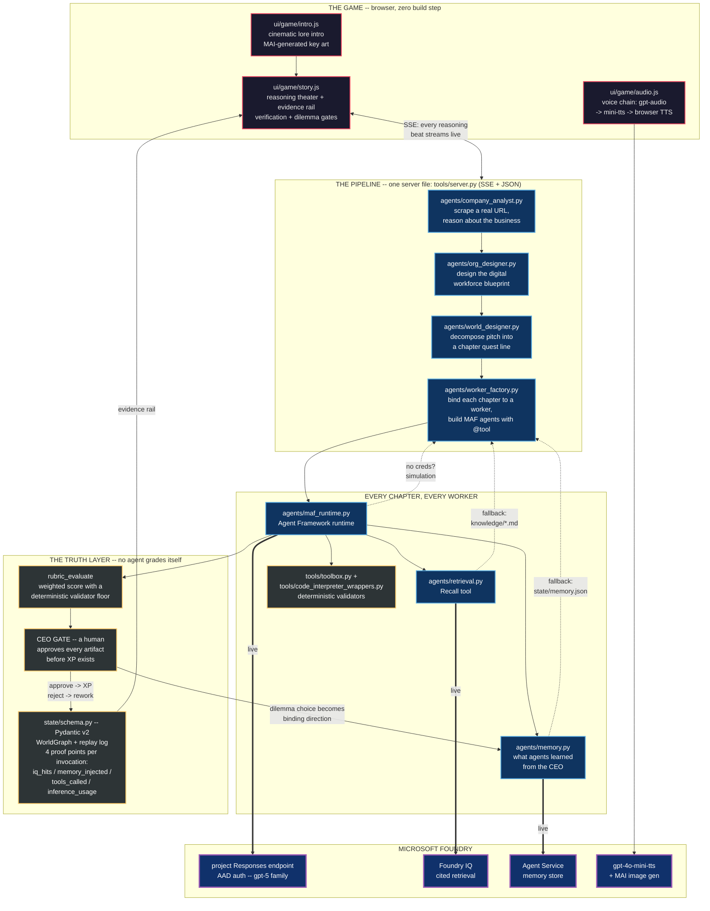

# Architecture

> For the intent behind this system - the CEO role-play, the lore, the two
> missions, and how the project evolved into its current shape - see
> [vision_and_evolution.md](vision_and_evolution.md).

## Core Pattern

The implementation follows the official RPG live-battle architecture and reskins it for business creation. The diagram below is the current shipped stack; every node names the actual file so it doubles as a code map.



Two properties to read off the diagram:

1. **The loop is closed.** The CEO's gate decision and dilemma pick are written to memory, and the next chapter's brief recalls them. Decision -> memory -> recall -> changed artifact.
2. **Every cloud arrow has a dashed twin.** Bold arrows are the live Foundry path; dashed arrows are the keyless local fallback. A fork with no credentials still plays end to end.

## Why We Picked Each Piece

| Choice | Why |
|---|---|
| Pitch or real company URL (`company_analyst`) | Anyone can throw their own company at it - instant relevance, no canned demo |
| Org Designer before World Designer | The business defines the workforce; the workforce defines the quests. Workers are designed per company, not hardcoded |
| Agent Framework + FoundryChatClient | The current Foundry project Responses path with AAD - and the battle rule: all reasoning on Foundry models |
| SSE, vanilla JS, one server file | Reasoning is streamable - the theater is just events arriving. The whole stack is readable in one walkthrough |
| Deterministic validator floor + human gate | The model never grades its own homework; a human owns every approval |
| Four proof points on every invocation | Every claim is a logged number, even in simulation mode |

## Agent Responsibilities

| Agent | Role | Foundry Requirement |
|---|---|---|
| Master Narrator | Orchestrates the quest, routes work, updates state, narrates consequences | Foundry-hosted model |
| Company Analyst | Scrapes and reasons about a real company URL to seed the brief | Foundry-hosted model |
| Org Designer | Designs the digital-workforce blueprint for this specific business | Foundry-hosted model |
| World Designer | Decomposes the pitch into a chapter quest line | Foundry-hosted model |
| Designed workers (Strategist, Designer, Marketer, ...) | Built per-chapter by the Worker Factory as Agent Framework agents with tools; produce positioning, landing-page structure, launch copy | Foundry-hosted model |

The Strategist / Designer / Marketer trio is the default cast; the Org Designer
can replace it with a workforce tailored to the pitched business.

## Tool Boundaries

- Foundry IQ retrieves curated business-launch knowledge with citations.
- Code tools perform deterministic checks and scoring.
- External deployment tools are optional and must support simulation mode.
- Human verification gates protect every artifact before XP is awarded.

## Presentation Boundaries

- The shipped UI is a zero-build vanilla JS story mode (`ui/story.html` + `ui/game/`): cinematic lore intro, reasoning theater, evidence rail, verification and dilemma gates, narrated voice-over.
- The visual style stays asset-light so the public repo remains forkable without private sprite or audio packs; key art is MAI-generated and committed under `ui/assets/generated/lore/`.
- Mermaid renders agent artifacts such as org charts, OKRs, integration maps, and GTM channels directly from agent output.

## Shared State Shape

```json
{
  "company": {},
  "stage": "idea",
  "active_quest": {},
  "agents": {},
  "business_flags": {},
  "artifacts": [],
  "replay_log": []
}
```

## Documentation Map

Where to read next, by question:

| Question | Document |
|---|---|
| Why does this project exist? The lore, the CEO frame, the missions | [vision_and_evolution.md](vision_and_evolution.md) |
| What is the game, exactly? Canonical design | [game_design.md](game_design.md), [game_loop.md](game_loop.md) |
| How do I present the whole build as one narrative? | [how_it_all_connects.md](how_it_all_connects.md) |
| How does it map to the official Battle #2 spec? | [agents_league_alignment.md](agents_league_alignment.md), [rubric_mapping.md](rubric_mapping.md) |
| How is Foundry wired in (IQ, memory, hosted agent, models)? | [foundry_integration_plan.md](foundry_integration_plan.md), [phase_reasoning_voice_hosted.md](phase_reasoning_voice_hosted.md) |
| How do the Org Designer and digital workforce work? | [org_designer_and_digital_workforce.md](org_designer_and_digital_workforce.md) |
| How do the World Designer and Worker Factory work? | [world_designer_and_worker_factory.md](world_designer_and_worker_factory.md) |
| How does the game speak (TTS pipeline)? | [narration_pipeline.md](narration_pipeline.md) |
| What do we show in the 20 minutes? | [demo_script.md](demo_script.md), [demo_constraints_and_film_plan.md](demo_constraints_and_film_plan.md) |
| What was the day-of working state? | [coordination_final_mvp.md](coordination_final_mvp.md) |
