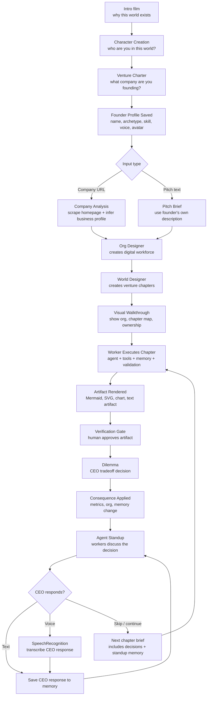
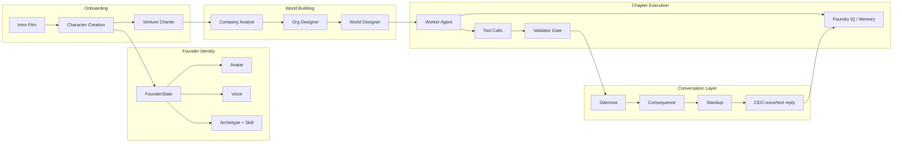
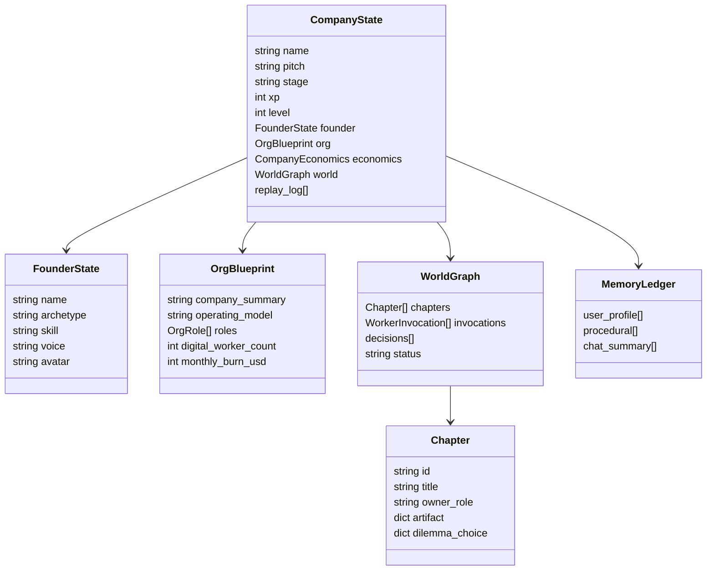
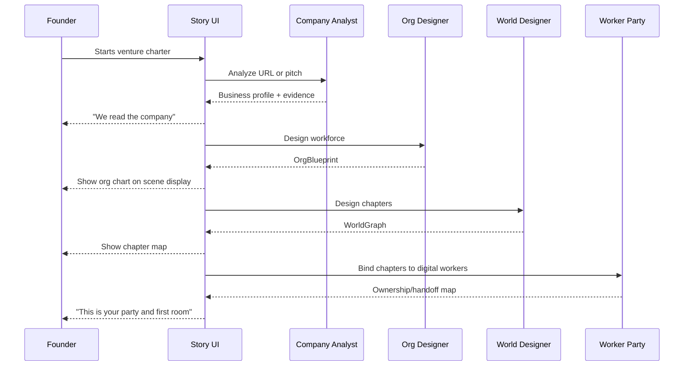
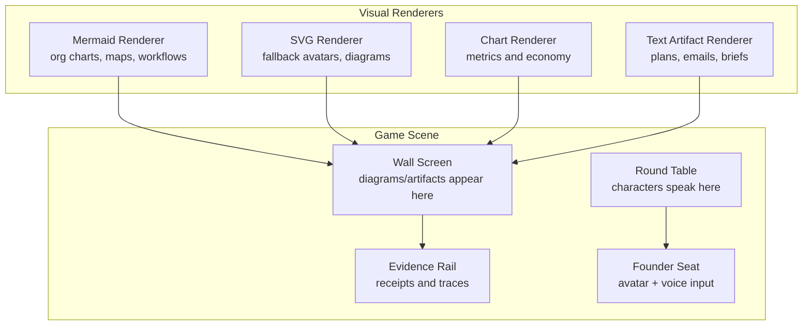
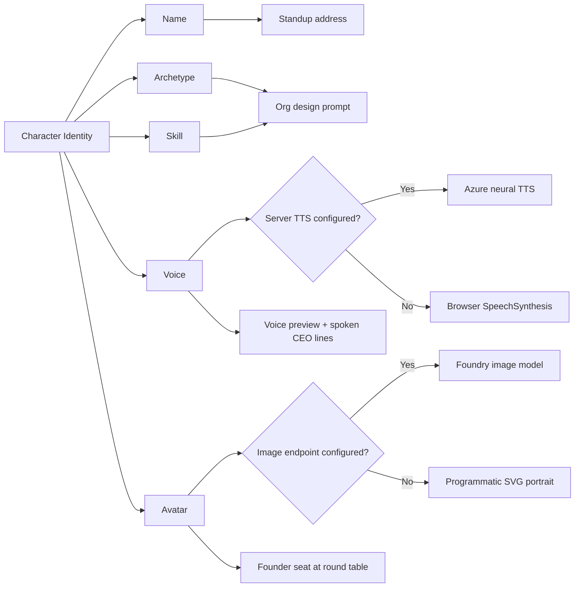
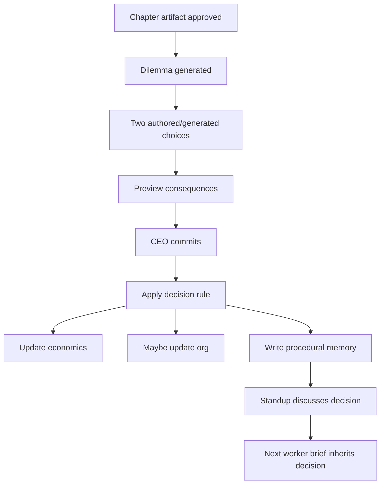
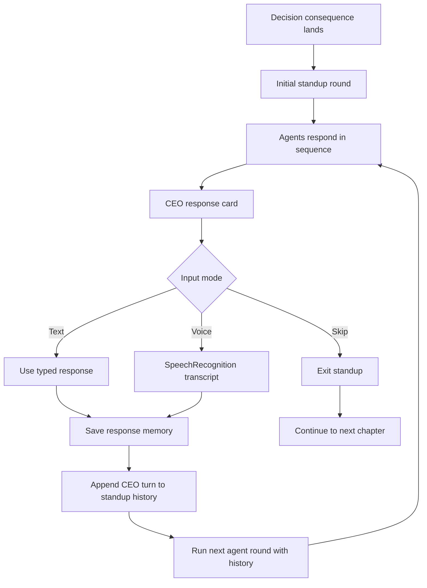
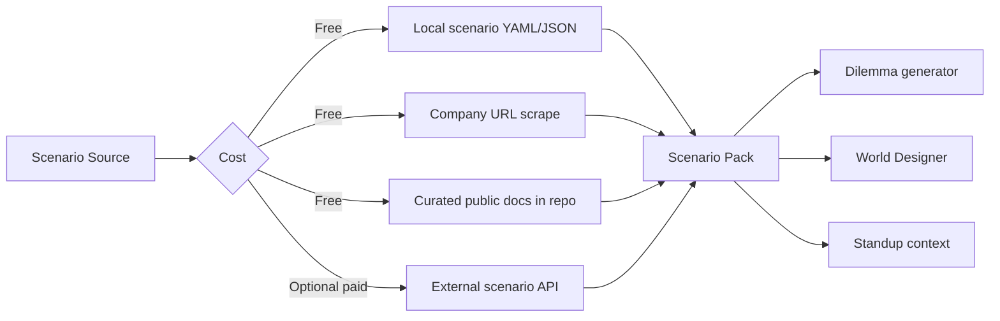
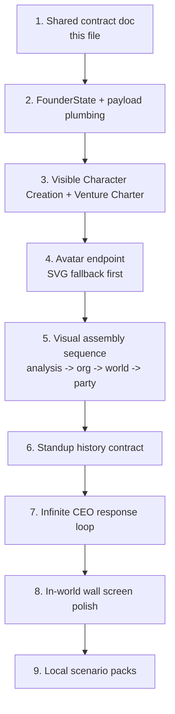

# Connected Experience Map

This document maps the core experience as one connected game system: intro,
founder creation, company analysis, workforce design, chapter execution,
dilemmas, voice, avatars, diagrams, and multi-agent standups.

The main product problem is not that the pieces are missing. The problem is
that the player needs to understand why each piece is happening, while still
feeling like they are inside a management RPG instead of watching a dashboard.

## 1. Main Player Journey

Core principle: every major game beat should produce visible state, not only
narration. The player should see the system remembering, assigning, checking,
and changing.

## 2. What Each System Is Responsible For

## 3. State And Memory Contract

Founder profile is the player's character sheet. It should influence:

- The org design prompt: "the human operator covers this skill."
- The worker brief: "this CEO tends to prefer this posture."
- The standup: agents address the founder by name.
- The voice layer: CEO responses and previews use the selected voice.
- The avatar layer: the founder appears as part of the party, not only as form data.

## 4. Visual Walkthrough Between Charter And First Chapter

Right now this is the confusing part: the system does important work, but the
player can lose track of what is happening. We need a visible sequence after
the charter and before the first chapter.

Recommended scene framing:

- Treat diagrams as in-world displays, not dashboard blocks.
- The round table is the conversation space.
- The wall screen is where Mermaid diagrams, org charts, and artifacts appear.
- Character cards or portraits sit around the table and speak when active.
- The evidence rail remains available, but it is secondary to the scene.

## 5. In-World Display Model

Mechanic: the agents are not "explaining a diagram." They are placing evidence
on the wall screen during a meeting. That makes complex Mermaid diagrams feel
natural.

## 6. Voice, Avatar, And Character Identity

Important distinction:

- Avatar is presentation.
- FounderState is identity.
- Memory is behavior over time.

Do not let image generation become required for the game. A strong SVG fallback
is enough for the core loop.

## 7. Dilemmas And Decision Trees

Dilemmas are the bridge between "the agent made something" and "the company is
changing." They should always show:

- What choice is being made.
- What metric or org state changes.
- Which future worker inherits the constraint.
- What memory is being written.

## 8. Infinite Standup Loop

Rules for keeping it stable:

- Each round should be short: 2-4 agent turns.
- The CEO can always skip and continue.
- The loop should store history locally in the UI and send it to the server.
- Server should degrade to deterministic turns if MAF is unavailable.
- Every CEO response should become procedural memory only after explicit submit.

## 9. Real-World Scenarios Without Paid Scenario APIs

We can still make scenarios feel real without paying for an external scenarios
API.

Recommended no-paid path:

- Add local scenario packs later: `submission/scenarios/*.yaml`.
- Scenario pack fields: industry, market shock, constraint, stakeholder, metric pressure.
- The World Designer and dilemma generator use these as context.
- URL scrape can choose a scenario pack by company type.

## 10. Current Gaps

| Area | Gap | Why it matters | Suggested next step |
| --- | --- | --- | --- |
| Visual walkthrough | The user does not clearly see company analysis -> org design -> world design -> worker binding as a sequence. | The system feels confusing even when it is working. | Add a pre-chapter "assembly sequence" with wall-screen diagrams and short narration. |
| Character creation | Founder identity exists conceptually, but needs to be first-class in state, payloads, and UI. | The player should feel like a character, not a form submitter. | Finalize `FounderState` and pass it through analyze/design/standup. |
| Founder avatar | Needs image-model path plus SVG fallback. | Presentation should be premium, but not depend on paid image calls. | Implement `/api/founder/generate-avatar` with SVG fallback first. |
| CEO voice | Voice preview and CEO response voice are not a unified mechanic yet. | Speaking should feel like part of being at the table. | Add voice dropdown + preview using existing `/api/tts` fallback chain. |
| Standup loop | First standup exists, but the infinite response loop needs a clear history contract. | Agents need to react to the CEO's words, not restart each time. | Add `history` to `/api/world/standup` and `run_maf_group_chat`. |
| Dilemma visibility | Consequences exist, but the relationship between decision, memory, next brief, and metrics needs clearer presentation. | Dilemmas are the core game mechanic. | Show "decision -> consequence -> memory -> next brief" as a compact receipt. |
| Mermaid as scene object | Diagrams render as UI artifacts, not always as in-world displays. | Complex diagrams feel less game-like unless grounded in the scene. | Frame diagrams as a wall screen or table projection. |
| Scenario realism | Real-world scenario inspiration is desired, but paid APIs are not ideal. | Scenarios make dilemmas more meaningful. | Use local scenario packs and URL-derived company type first. |
| Parallel agent work | Multiple agents are editing connected surfaces. | High risk of conflicting implementation choices. | Use this doc as the shared contract before touching active files. |

## 11. Suggested Build Order

This order keeps the core stable: state first, then UI, then live generation,
then infinite conversation, then optional realism.

