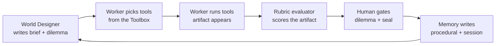

# Foundry Integration Plan - Two Agents, One Toolbox, One Loop

How everything we found in the Build 2026 wave lands in this repo without
inventing new agents. Companion to [game_design.md](game_design.md) - that
doc says what the game is; this doc says how the Microsoft platform pieces
plug into it.

---

## 1. The architecture rule

**We do not need more agents. We need a small set of agents with a deep
toolbox, running a loop.**

What looks like a "subagent" in every Build 2026 demo is really:

```
pick tool -> run it -> check the result -> write to memory -> repeat
```

That is a loop with tools, not a new mind. So the whole platform wave maps
onto exactly two reasoning agents:

| Agent | Role | Deployment | What it owns |
|---|---|---|---|
| **World Designer** | narrator / decomposer | gpt-5 family | the venture quest line, chapter briefs, dilemmas, the story voice |
| **Worker** | one parameterized executor | gpt-5-mini or MAI-Thinking-1 | every role in the org chart - Strategist, Marketer, Builder - same agent, different brief + toolset |

`worker_factory.py` already builds workers this way (role + prompt +
deployment binding). We keep that. We never add a third agent class.
Everything below is a **tool** the two agents call, or a **stage of the
loop** that runs around them.

## 2. The loop (where every platform piece lives)

One chapter of the game = one pass of this loop. Every Build 2026 item has
exactly one home in it:



| Loop stage | Platform piece | Status |
|---|---|---|
| pick tools | **Toolboxes in Foundry** (+ tool search, skills catalog) | preview |
| run tools | code interpreter, Mermaid, **MAI-Image-2.5**, **Browser Automation**, IQ retrieval | mixed |
| score | **Rubric evaluator** (replaces hand-rolled gate scoring) | preview |
| gate | **MAF human-in-the-loop workflow node** (our verification gate, canonical form) | GA |
| remember | **Memory in Foundry Agent Service** (procedural / user / session) | preview |
| loop unattended | **Routines** (the income beat - workforce on a timer) | preview |
| host the loop | **Hosted agents** (deploy from source, no container) | GA ~July |
| govern the loop | **ACS** YAML contract + **ASSERT** policy evals | open source |

## 3. The Toolbox - one endpoint, all our tools

Today our tools are scattered Python functions the server calls directly.
The move: register them behind one Toolbox so any agent (and any judge
forking the repo) reaches every tool through a single MCP URL.

| Tool in the Toolbox | Today in repo | Becomes |
|---|---|---|
| `validate_artifact` | tools/code_interpreter_wrappers.py | code interpreter tool, same validators |
| `render_diagram` | ui/vendor/mermaid (client-side) | stays client-side; the *spec* the worker emits is the tool output |
| `generate_image` | tools/generate_art.py | MAI-Image-2.5 deployment (adds image-to-image for art regen) |
| `speak` | /api/tts chain | MAI-Voice-2 when available (per-worker voices via cloning), gpt-4o-mini-tts fallback |
| `transcribe` | browser STT only | MAI-Transcribe-2 behind /api/stt, browser fallback |
| `recall` | agents/retrieval.py (mocked) | Foundry IQ serverless retrieval - the required primitive, real |
| `map_company` | URL field (cosmetic) | Browser Automation tool crawls the URL, seeds the org brief |

Sample to copy: `foundry-samples/.../hosted-agents/agent-framework/responses/04-foundry-toolbox`.

Fallback rule (unchanged law of the repo): every tool degrades to its
current local implementation when the Toolbox is unreachable. A fresh
clone with zero keys still plays.

## 4. What we explicitly do NOT adopt

- **More agent classes** - Magentic-One, connected agents, deep research
  agent: all solve coordination problems we do not have. Two agents, flat
  handoff, done.
- **Sora 2 in the runtime** - lore videos stay pre-baked assets. We may
  regenerate them with Sora 2 offline and say so in CREDITS.md, but video
  generation never enters the game loop.
- **Teams / M365 publishing, Fabric, Web IQ** - wrong audience for a game
  demo. One line in the pitch ("the same agent publishes to Teams") is
  enough.
- **Fine-tuning / Frontier Tuning** - post-battle experiment, not now.

## 5. Build order (extends game_design.md section 9)

The game build order (dilemma gates, org chart, archetypes, images, income
beat) stays first - it is the game. This platform work slots in around it:

1. **Rubric evaluator at the gate** - swap the gate score source from
   hand-rolled numbers to a Foundry Rubric evaluation, keep validators as
   the deterministic floor. Smallest change, biggest rubric resonance:
   *the judges grade us on a rubric while our gates grade artifacts with
   Foundry's rubric evaluator.*
   Touches: tools/code_interpreter_wrappers.py, tools/server.py (gate
   scoring path), docs/rubric_mapping.md.
2. **Toolbox registration** - stand up a Toolbox in the Foundry project,
   register validate/generate_image/recall, point the hosted agent at the
   one URL. Local fallbacks intact.
   Touches: hosted_agent/main.py, agents/model_config.py, .env.example
   (TOOLBOX_URL).
3. **Foundry IQ serverless retrieval** - replace the retrieval mock with
   the real knowledge base over submission/knowledge/. This is the
   required scaffold primitive; it must be real before demo close.
   Touches: agents/retrieval.py, knowledge/.
4. **Memory (procedural + session)** - wire the memory rail panel to real
   Foundry Agent Service memory. Dilemma choices write session memory;
   repeated quest runs build procedural memory ("the workforce learns the
   job"). The rail stops being cosmetic.
   Touches: state/schema.py (memory refs), tools/server.py, ui rail.
5. **Routine for the income beat - backed by the real Poly platform** -
   the deployed Poly platform (digital workers, workflow engine, MCP
   integration layer - the maintainer's real product) IS the workforce the
   game fictionalizes. The income beat calls its live backend (API key in
   .env) to run one real worker task unattended, and the counter ticks on
   a real result. Per repo law, Poly is a *tool* outside the Foundry
   reasoning path, with full simulation fallback - a keyless clone still
   plays the beat scripted.
   Touches: hosted_agent/agent.yaml (routine), tools/server.py (POLY_API
   proxy + fallback), .env.example (POLY_API_URL, POLY_API_KEY).
6. **ACS + ASSERT as the governance story** - express one quest's controls
   (input -> LLM -> state -> tool -> output) as an ACS YAML next to the
   quest YAML; run ASSERT once against the gate policy and commit the
   result. Cheap, citable, pure Reliability points.
   Touches: quests/ (one .acs.yaml), docs/rubric_mapping.md.

Voice/STT upgrades (MAI-Voice-2, MAI-Transcribe-2) ride along whenever the
deployments are available in our project - they are env-var swaps in the
existing chains, not build items.

## 6. Ludonarrative coherence - the law of the demo

The risk has a name: **ludonarrative dissonance** - the story says one
thing, the gameplay does another. A demo that *narrates* "your workforce
runs while you sleep" while a slideshow advances is dissonant. The rule:

> **No platform piece may appear in the demo as a name-drop. It must
> appear as something the player does, sees, or judges - in-fiction.**

| Platform piece | Forbidden (dissonant) | Required (diegetic) |
|---|---|---|
| Toolbox | "we use Toolboxes in Foundry" | the worker visibly *reaches for a tool* - the rail shows which tool it drew and why |
| Rubric evaluator | "Foundry scores our gates" | the gate's score bar fills from the rubric's weighted dimensions, on screen |
| Foundry IQ | "we have RAG" | memory citations surface in the rail *as the worker reasons*, quoted in its handover |
| Memory | "agents have memory" | chapter N's brief visibly references the player's chapter N-1 dilemma choice |
| Routine + Poly | "agents can run on timers" | the final beat: the screen goes quiet, the org runs, the income counter ticks - a real Poly worker did real work |
| ACS | "we follow the spec" | the quest's ACS YAML is shown as *the law of the campaign graph* - the five checkpoints are the five things the player watched happen |
| Hosted agents | "it's deployed" | the demo itself is played against the hosted endpoint, and we say so once |

If a piece cannot be made diegetic by demo time, it goes in the roadmap
slide - it does not get spoken over gameplay.

## 7. Demo-day honesty

On stage we claim only what runs. The tiering for June 10:

- **Run live:** the loop with Rubric-scored gates (1), IQ retrieval (3) if
  wired in time, and the Poly-backed income beat (5) if the API key is in
  .env - the platform is already deployed, so this is a proxy endpoint +
  fallback, not a build.
- **Show wired, narrate briefly:** Toolbox (2), memory rail (4).
- **Name as roadmap, point at this doc:** ACS/ASSERT (6), voice upgrades.

---

*The one sentence: two agents and a toolbox, running one loop - pick,
run, score, gate, remember - every Microsoft piece diegetic inside it,
and at the end the fiction drops: the workforce on screen is Poly, and
it is real.*
