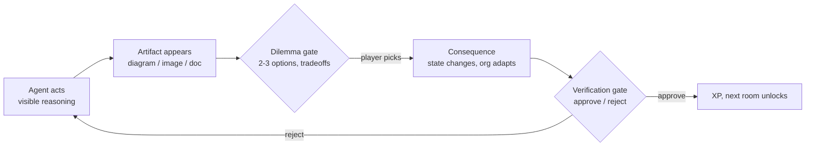
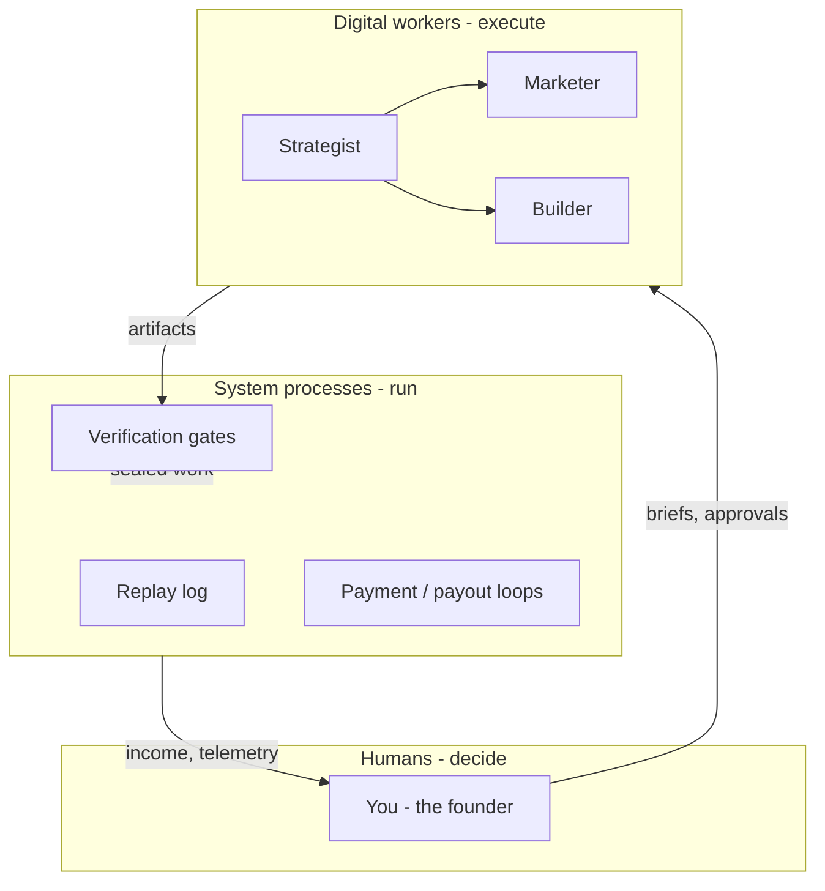

# The Game - Design Document

This is the canonical description of what "Your Company Is the Dungeon" is,
what the player does, and what the build must become. Everything else
(narration pipeline, art pipeline, server endpoints) is plumbing in service
of this document. When a feature decision is unclear, come back here.

---

## 1. The essence

**You are the hero of a story that is too big for you - on purpose.**

The world: terraform the Sahara, automate basic needs. The vow underneath it
(from the Poly186 whitepaper, 2021): *no belly goes hungry, no head goes
without a roof, no back is unclad, no soul is enslaved to survival.* Our
daily lives are suspended within a web of social contracts between a
multitude of organizations and institutions; updating that web is the
largest lever there is.

You cannot command any of this into existence. So the game hands you the
only instrument that scales: **a league of reasoning agents working as your
digital workers** - automating your basic needs by automating how your
skill set makes money. You decide; they execute; nothing counts until you
press the seal.

The game is the on-ramp into that world: you found one company on one front
of the mission, and you play it like a dungeon - room by room, choice by
choice, gate by gate.

## 2. The problem this document solves

The build today is **a film followed by a slideshow**. The intro is
beautiful but passive - click, read, listen. The chapters are narrated
beats with diagrams - watch, wait, approve. The player's only verbs are
"advance" and "approve." That is not a game; that is a presentation with
consent.

A role-playing game needs the player to **choose a role and then make
choices that matter inside it**. Every beat must either ask the player
something or be consequence of something the player chose. That is the
standard every screen has to meet from here on.

## 3. The interaction grammar (how the player speaks)

Small, consistent, keyboard-and-click first. Nothing exotic:

| Verb | Input | Where |
|---|---|---|
| Move through the story | space / right arrow / click | everywhere |
| Step back | left arrow | everywhere |
| Choose between options | 1-4 keys, arrow keys + enter, or click a card | dilemma gates, missions |
| Speak instead of type | mic button (browser STT) | pitch, edge, free answers |
| Judge an artifact | Approve / Reject buttons | verification gates |
| Bail / skip | Esc | intro, any overlay |

The framework rule for agents: **an agent may ask the player a question at
any beat, but it must arrive as clickable options (2-4 cards) with an
optional free-text escape hatch.** Never a bare text prompt. Clicking is
the primary verb; typing is always optional.

## 4. The game loop (one chapter = one room)

Two different gates, two different muscles:

- **Dilemma gate** (new): *before or during* the work. The agent surfaces a
  real tradeoff from the venture - "Compliance-first or speed-first?",
  "Spend the remaining budget on supply or demand?" - as 2-3 clickable
  options, each with a visible cost. The choice writes into state and the
  org/plan visibly adapts. This is role-play: the player is making CEO
  decisions, not watching them.
- **Verification gate** (existing): *after* the work. The deterministic
  validator scores the artifact, the human approves or rejects. This is
  judgment: the law of the world.

The loop in one sentence: **the agent reasons, the player chooses, the
agent executes the choice, the player judges the result.**

## 5. Dilemma gates - the missing mechanic

Each chapter ships with one authored dilemma (deterministic, demo-safe)
plus a hook for the agent to generate situational ones. Examples per
existing chapter:

| Chapter | Dilemma (2-3 options, all defensible) |
|---|---|
| Discovery | Which wedge first: energy (hardware, slow, deep moat) vs logistics (software, fast, shallow moat)? |
| Org design | Hire a second human (burn up, trust up) vs add 3 digital workers (leverage up, oversight cost up)? |
| Build | Ship the 70% landing page this week vs the 95% one in three? |
| GTM | Price for adoption (low, grassroots) vs price for runway (high, fewer, bigger)? |
| Retention | Automate support fully (margin) vs keep a human in the loop (trust, the brand promise)? |

Choices must have visible consequences: the org chart re-renders, the burn
number moves, the next chapter's brief references the decision. Memory is
what makes a choice feel real.

**Current contract:** `/api/dilemma` returns a structured scene packet, not
just text. Each option carries an explicit `rule_id`, an `effect_preview`
receipt, and a short effect line. `/api/decision` commits that `rule_id` and
returns the mutated state. This means later voice/avatar scenes can reuse the
same dilemma contract without inventing a second decision path.

## 6. The org chart - the central artifact

The org the player builds is not a list of agents. It is **three lanes**:

Humans decide. Digital workers execute. System processes (gates, logs,
contracts, payout loops - the smart-social-contract layer) bind the two.
Every venture the World Designer decomposes should render this three-lane
diagram, and the dilemma gates should visibly mutate it.

This is also the bridge to the larger story: the same three lanes, scaled
up, are the Poly186 organism - users as cells, teams as tissues, platforms
as organs. The player's company is a small organism learning to feed
itself. That is why the game's final beats are about **self-organized
earning**: the org goes out, makes money from the player's skill set, and
the income loop closes.

## 7. Agents get tools (show, don't narrate)

We have APIs; the agents should use them on-screen as their own voice:

| Tool | API (already in repo) | What the agent does with it |
|---|---|---|
| Diagram | Mermaid (vendored) | org charts, system maps, journey maps - rendered live, not described |
| Image | Foundry MAI deployment (generate_art.py path) | chapter key art, product mockups, brand frames - generated for THIS venture |
| Voice | TTS chain (baked -> /api/tts -> browser) | each worker speaks in its own voice when it hands over work |
| Validation | code-interpreter wrappers | scores it cannot fake, shown as numbers moving |
| Memory | Foundry IQ retrieval | citations surfacing in the rail when an agent reasons |

Rule: when an agent finishes work, **the artifact appears as a thing**
(diagram, image, scored document) - never as a paragraph of narration about
a thing. Narration sets scenes; tools show work.

## 8. The narrative spine (intro -> gameplay, one thread)

The intro is the cosmology; the gameplay is the player's verse of it. The
hand-off must be seamless:

1. **Intro film** (built): the world, the vow, the mechanism, the law, the
   title. Ends on "choose your front."
2. **Character creation** (thin today - deepen): not just "what you bring"
   as text. 3-4 clickable archetypes (Designer / Seller / Operator /
   Builder) + optional free text + mic. The archetype seeds the org design
   - your skill becomes the human lane of the chart.
3. **The founding** (built): pitch or URL -> org chart (three lanes now)
   -> world decomposition into chapters.
4. **The chapters** (built as slideshow - add dilemma gates): each room =
   reasoning + artifact + dilemma + seal.
5. **The closing of the loop** (the part the narrative promises): the org
   runs without you for a beat - work executes, gates hold, income ticks -
   and the game names what just happened: *your experience became a
   business that runs while you sleep.* Then it points back up at the
   mission: this, times a billion people, is how a desert turns green.

## 9. Build order (what to do, in priority)

1. **Dilemma gate component** - one reusable overlay: prompt, 2-3 option
   cards (keyboard 1-3, arrows + enter, click), consequence writeback to
   state + visible org/burn change. Wire one authored dilemma into each
   existing chapter. This single component converts the slideshow into a
   game.
2. **Three-lane org chart** - extend the org Mermaid render to
   humans/digital-workers/system-processes lanes; re-render on every
   dilemma consequence.
3. **Character archetypes** - upgrade the intro choice screen's edge field
   to archetype cards; feed the selection into the org designer brief.
4. **Per-venture image generation** - one MAI image per chapter, generated
   from the venture brief at runtime (fallback: committed stills). Agents
   showing their own art.
5. **The income beat** - a final autoplay beat where the loop closes and
   the counter ticks. Short, scripted, lands the whole thesis.

Anything that does not serve one of these five is polish. Platform wiring
(Toolbox, Rubric evaluator, IQ, memory, routines) has its own ordered plan
in [foundry_integration_plan.md](foundry_integration_plan.md) - the rule
there: two agents, one toolbox, one loop; never a new agent class.

## 10. Rubric honesty check

| Criterion | Where this design earns it |
|---|---|
| Reasoning & multi-step | dilemmas force visible tradeoff reasoning; consequences chain across chapters |
| Reliability & safety | two gate types; deterministic validators; human seal unchanged |
| Accuracy & relevance | same Foundry primitives (IQ, code interpreter, orchestration) - now player-steered |
| Creativity | the dungeon is choices, not rooms; the whitepaper cosmology gives it stakes |
| UX & presentation | click-first grammar, artifacts as things, film -> game with no seam |

---

*The one sentence: the intro invites you into a story too big to command;
the game lets you answer - choice by choice, gate by gate - until your
company runs without you, and the story gets one founder bigger.*
