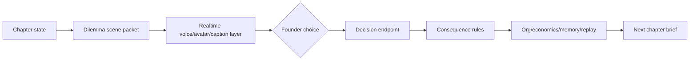

# Realtime Avatar Dilemma System

This document defines the next interaction layer for "Gamifying World Improvement": dilemmas should feel like live scenes with speaking agent characters,
captions, visible tool calls, stateful images, and choices that immediately
change the company.

The current game loop stays intact. The realtime layer is an input/output
surface over the same authoritative state machine: chapters, dilemmas,
consequence rules, memory, org graph, economics, validation gates, and replay
log.

## 1. Why this matters

The game becomes engaging when the founder feels surrounded by a living company:

- A strategist speaks with a distinct voice and asks for a decision.
- The designer shows a scene image, mockup, or artifact instead of describing it.
- The operator calls a tool and the UI shows the call resolving.
- Captions keep the game playable with sound off.
- The founder can answer by clicking, typing, or speaking.
- The chosen option updates the org chart, burn, runway, proof, trust, and the
  next chapter brief.

The goal is not "voice chat" as a novelty. The goal is a cohesive CEO role-play
where each agent has a presence, tools, memory, and consequences.

## 2. Reference Pattern From Poly

The Poly realtime implementation gives us a proven shape to adapt without
copying product-specific code.

Observed pieces:

| Layer | Pattern to reuse |
| --- | --- |
| React context | A thin provider exposes realtime state and actions while delegating the actual connection to a manager and Zustand slices. |
| Store slices | Connection, conversation, and audio are separate slices. This keeps mic state, transcript state, tool-call state, and playback state independent. |
| Connection manager | A singleton owns WebSocket lifecycle, audio recorder, audio playback, avatar WebRTC, callbacks, reconnect cleanup, and interruption handling. |
| Session initialize | Client sends worker id, context, voice id, avatar id, style id, tier, avatar mode, and optional continuation id. |
| Avatar stream | Server emits avatar session details, client creates a receive-only WebRTC connection, then binds the video stream into an avatar view. |
| Captions | Transcript deltas are sanitized and rendered live. Completed worker/user turns are stored separately from the live caption. |
| Tool stream | `tool_call_started` and `tool_call_completed` events become visible execution history in the UI. |
| Fallbacks | Avatar can degrade to voice-only. Voice can degrade to text/captions. The session is still usable. |

That shape maps well to this repo because the game already has:

- a stateful server in `submission/tools/server.py`;
- deterministic decision consequences in `submission/state/consequences.py`;
- live UI state and gates in `submission/ui/game/story.js`;
- per-agent voices in the narration layer;
- visible reasoning and evidence rails.

## 3. Microsoft Voice Live Fit

Microsoft Voice Live is the correct platform primitive for the richer version
of this layer because it supports low-latency speech interaction, generated
audio output, avatar visuals, and function calling/tool use through a realtime
event model.

The important design constraint: browser clients must not receive service
secrets. The game should use a middle tier for session creation and tool
authorization. The browser may connect with a short-lived client token or to
our own game WebSocket, but authoritative tool execution and state mutation
must remain server-side.

Public references:

- [Voice Live API overview](https://learn.microsoft.com/en-us/azure/ai-services/speech-service/voice-live)
- [Voice Live how-to](https://learn.microsoft.com/en-us/azure/ai-services/speech-service/voice-live-how-to)
- [Voice Live API reference](https://learn.microsoft.com/en-us/azure/ai-services/speech-service/voice-live-api-reference-2025-10-01)

### Avatar API Mechanics

Voice Live enables avatar output through the session `avatar` parameter. For a
standard video avatar, the important fields are:

```json
{
  "session": {
    "avatar": {
      "character": "lisa",
      "style": "casual-sitting",
      "customized": false,
      "video": {
        "codec": "h264",
        "resolution": { "width": 1920, "height": 1080 },
        "bitrate": 2000000
      }
    }
  }
}
```

For a photo avatar:

```json
{
  "session": {
    "avatar": {
      "type": "photo-avatar",
      "model": "vasa-1",
      "character": "anika",
      "customized": false
    }
  }
}
```

For a custom photo avatar, `character` becomes the custom avatar name and
`customized` is `true`.

The video stream is negotiated through WebRTC:

1. Server emits `session.updated` with avatar config and ICE servers.
2. Browser creates an `RTCPeerConnection`.
3. Browser sends `session.avatar.connect` with a base64 encoded SDP offer.
4. Service responds with `session.avatar.connecting` and server SDP.
5. Browser sets the remote description and renders the incoming media stream.

The implementation must expect avatar failure as a normal runtime condition:
capacity limits, regional availability, browser/WebRTC constraints, or ICE
network issues can all force a fallback to voice-only or captions-only mode.

## 4. Core Principle

Realtime is not a second game engine.



The realtime layer may present, narrate, and collect input. It may request
tool calls. It does not directly invent company state. State changes only
through the same consequence and validation paths used by Story Mode.

## 5. Dilemma Scene Packet

Every dilemma should be produced as a structured scene, not only a prompt and
free-text options.

```json
{
  "scene_id": "ch_2_build:dilemma",
  "chapter_id": "ch_2_build",
  "setting": "The launch room before the first public release.",
  "speaker": {
    "worker_id": "designer",
    "display_name": "Mara",
    "role": "Product Designer",
    "voice_id": "en-US-...",
    "avatar_id": "avatar-...",
    "style_id": "standing-casual",
    "locale": "en-US"
  },
  "caption_seed": "The prototype is useful, but not beautiful yet.",
  "image_prompt": "A focused product war room with a live launch dashboard...",
  "tool_plan": [
    {
      "tool": "calculate_consequence",
      "reason": "Preview burn, trust, velocity, and proof changes."
    },
    {
      "tool": "render_org_graph",
      "reason": "Show how the workforce changes after the decision."
    }
  ],
  "options": [
    {
      "id": "ship_now",
      "label": "Ship the useful version",
      "rule_id": "designer.ship",
      "spoken_summary": "We launch sooner and learn faster, but polish takes a hit.",
      "effect_preview": {
        "monthly_burn_usd": 0,
        "runway_months": 1,
        "velocity": 8,
        "trust": -4,
        "proof": 5,
        "org_additions": []
      }
    }
  ]
}
```

Required fields for implementation:

| Field | Why it matters |
| --- | --- |
| `scene_id` | Idempotence for replay, memory, and duplicate realtime events. |
| `speaker` | Binds the scene to a character voice, avatar, language, and current role. |
| `tool_plan` | Lets the UI show agents using tools before asking for a choice. |
| `options[].rule_id` | Makes consequence mapping deterministic. No substring matching. |
| `options[].effect_preview` | Shows the player what will change before committing. |
| `image_prompt` | Gives the visual layer a state-aware scene asset. |

## 6. Character Casting

Generated workers should become cast members, not just rows in the org chart.

```json
{
  "worker_id": "strategist",
  "display_name": "Inez",
  "role": "Market Strategist",
  "locale": "en-US",
  "voice_id": "en-US-voice-a",
  "avatar_id": "avatar-a",
  "style_id": "professional",
  "portrait_url": "/assets/generated/workers/strategist.png",
  "temperament": "calm, direct, evidence-led",
  "toolbelt": ["recall_memory", "calculate_consequence", "render_market_map"],
  "allowed_consequence_rules": ["strategist.depth", "strategist.breadth"]
}
```

Rules:

- Pick voice and avatar once per worker and persist them in game state.
- Treat the avatar as a render target for a character, not as the whole
  character identity.
- Randomize from English and Spanish voice pools based on the worker locale,
  not on every render.
- Keep captions in the same language as the speaking voice when possible.
- Let bilingual workers exist intentionally, for example a GTM worker who can
  switch between English and Spanish when addressing different markets.
- If avatar streaming fails, show the worker portrait and live captions.
- If audio fails, keep captions, tool calls, images, and click choices.

### Avatar Capacity Reality

Microsoft provides a finite catalog of standard full-body avatars and a broader
set of talking-head photo avatars. Voice Live also supports custom photo
avatars by setting `type` to `photo-avatar`, `model` to `vasa-1`, the custom
avatar name as `character`, and `customized` to `true`.

That means we do not need one unique full-body avatar per generated worker.
Instead:

- use full-body avatars for the signature cast, such as Narrator, Strategist,
  Designer, Marketer, and Operator;
- use talking-head/photo avatars for wider generated worker variety;
- use generated still portraits as the universal fallback;
- keep character identity in `AgentCharacter` fields: name, role, language,
  voice, temperament, toolbelt, memory, and consequence rules.

This avoids exponential avatar requirements while still letting the game feel
like it has many different people in the company.

## 7. Tool Moments

Agents should visibly use tools at moments where the player expects evidence.

| Tool moment | User-facing effect | State effect |
| --- | --- | --- |
| `calculate_consequence` | Before/after metrics appear next to each choice. | No mutation until the founder commits. |
| `commit_decision` | The selected option locks, the consequence board animates, and memory logs the choice. | Mutates org, economics, chapters, memory, replay. |
| `render_org_graph` | Org chart redraws immediately after the decision. | Reads current org state. |
| `render_scene_image` | Scene image appears behind or beside the speaking agent. | Stores image artifact reference. |
| `retrieve_memory` | Evidence rail shows the prior choice or relevant company fact. | Reads memory/state only. |
| `validate_artifact` | Verification score appears after work is produced. | Writes validation artifact and gate result. |

Music should stay out of the first realtime build. Short local UI stingers are
reasonable later, but arbitrary generated music adds licensing, latency, and
attention problems without improving the core decision loop.

## 8. Realtime Event Contract

The browser should receive a small game-specific event stream, whether the
backend is proxying Voice Live, using its own WebSocket, or replaying a
simulation fixture.

```json
{ "type": "game.scene.started", "scene": { "...": "DilemmaScenePacket" } }
{ "type": "game.agent.speaking", "worker_id": "strategist", "status": "started" }
{ "type": "game.caption.delta", "text": "We can go deep..." }
{ "type": "game.audio.delta", "audio": "base64-pcm16-or-reference" }
{ "type": "game.avatar.status", "status": "connecting" }
{ "type": "game.avatar.stream_ready", "stream_id": "..." }
{ "type": "game.tool.started", "call_id": "c1", "tool": "calculate_consequence" }
{ "type": "game.tool.completed", "call_id": "c1", "result": { "...": "..." } }
{ "type": "game.choice.previewed", "option_id": "ship_now", "effect_preview": {} }
{ "type": "game.decision.committed", "option_id": "ship_now", "consequence": {} }
{ "type": "game.state.updated", "state": { "org": {}, "economics": {} } }
{ "type": "game.scene.ended", "scene_id": "ch_2_build:dilemma" }
```

The UI should treat these events as rendering instructions. The server remains
the source of truth.

## 9. MVP Scope

Build realtime in phases so it does not destabilize the submission.

### Phase 1 - Story Mode Consequence Scenes

Implemented baseline, no live mic yet. Current Story Mode dilemma cards are
structured scenes:

- `/api/dilemma` returns `DilemmaScenePacket`.
- Options include `rule_id` and `effect_preview`.
- The UI shows the speaking worker, visible tool-call strip, option effect
  lines, and before/after effects after commit.
- `/api/decision` accepts `rule_id`, applies the consequence, and returns the
  new state.

Still pending inside Phase 1:

- a scene image slot wired to `image_prompt`;
- full `AgentCharacter` persistence for voices, avatars, styles, and locales.

### Phase 2 - Realtime Voice For Dilemma Gate

Only the dilemma gate becomes realtime:

- Add `RealtimeDilemmaProvider` on top of the existing Story Mode state.
- Start a realtime session when the dilemma opens.
- Let the agent speak the scene prompt.
- Founder can still click choices; mic answer maps to one of the same option
  ids only after confirmation.
- Tool calls are allowlisted to preview, image, memory, and commit tools.

### Phase 3 - Avatar Surface

Add avatar and image composition:

- Persist worker voice/avatar/style selections.
- Show the avatar stream when available.
- Use a still portrait fallback.
- Chroma-key or crop avatar output only in the presentation component, not in
  game logic.
- Keep captions visible over every avatar mode.

### Phase 4 - Multi-Agent Live Rooms

Let workers hand off within a room:

- `agent_switched` changes the active speaker.
- The strategist can call the designer, marketer, or operator into the scene.
- The player still commits exactly one explicit decision at the dilemma gate.

### Phase 1.5 - Agent Stand-Up After Choices

Implemented baseline and upgraded to support infinite multi-turn group chat conversations. After `/api/decision` applies a consequence, Story Mode calls `/api/world/standup` and renders a short manager-directed group-chat beat:

- The owning worker explains how the choice changes the handoff;
- A new org role can speak if the consequence added one;
- The next worker reads memory and operating metrics before its brief;
- The Runway Steward reacts to burn, runway, and digital-worker count.

The player (CEO) can respond to the workforce using text or voice (transcribed using local SpeechRecognition STT via the microphone button). Saving the comment registers it into procedural memory, then the client recursively calls `/api/world/standup` with the accumulated conversation history. The agents dynamically respond to the CEO's input in character, enabling an interactive chat standup loop that runs infinitely until the CEO chooses to "End Standup".

If live models are configured, the group chat executes sequentially on Microsoft Agent Framework (`run_maf_group_chat` inside `maf_runtime.py`) using the models specified in the model config, carrying the conversation history forward. Otherwise, it gracefully falls back to structured simulation turns.

### Phase 5 - Full Realtime Campaign

Only after the above works:

- voice-driven pitch intake;
- live chapter briefings;
- live rework after rejected artifacts;
- optional bilingual scenes;
- optional final "company runs without you" realtime simulation.

## 10. Backend Shape

Recommended server additions:

| Endpoint or module | Responsibility |
| --- | --- |
| `state/scene_schema.py` | Pydantic models for `DilemmaScenePacket`, `AgentCharacter`, `EffectPreview`, and realtime events. |
| `state/character_casting.py` | Deterministic voice/avatar assignment from org workers and locale pools. |
| `tools/server.py:/api/dilemma` | Return authored/generated scene packet with deterministic rule ids. |
| `tools/server.py:/api/decision` | Accept `rule_id`; reject unknown or stale scene ids; return full updated state. |
| `tools/server.py:/api/world/standup` | Return post-choice group-chat turns, tool calls, and handoffs for Story Mode. |
| `tools/server.py:/ws/game/realtime` | Game event stream and simulation replay path. |
| `tools/realtime_voice.py` | Voice Live session adapter, hidden behind simulation fallback. |
| `tools/game_tools.py` | Allowlisted tools callable by realtime agents. |

Keep all tool execution server-side. The browser can request a decision, but it
cannot directly mutate state or invoke arbitrary tools.

## 11. Frontend Shape

Recommended UI pieces:

| Component | Responsibility |
| --- | --- |
| `RealtimeDilemmaStage` | Owns scene layout: avatar/portrait, scene image, captions, option cards, tool strip, before/after board. |
| `RealtimeCaptionPanel` | Shows live transcript and completed turns. |
| `RealtimeToolStrip` | Shows started/completed tool calls with compact status. |
| `AvatarFrame` | Binds WebRTC stream when available; falls back to portrait. |
| `EffectPreviewCard` | Renders `effect_preview` before commit and actual `consequence` after commit. |
| `useRealtimeGameSession` | Connect/disconnect/send message wrapper for the game event contract. |

For the current vanilla Story Mode build, these can start as plain functions in
`submission/ui/game/story.js`. If the project later moves to React, the same
contract can become components without changing the backend.

## 12. Testing Strategy

The feature should be testable without Azure access.

Required tests:

- Scene schema validation: every authored dilemma option has a `rule_id` and
  `effect_preview`.
- Consequence determinism: committing a `rule_id` mutates org/economics exactly
  as expected.
- Idempotence: retrying the same `scene_id` and `option_id` does not duplicate
  memory or workers.
- Event replay: a fixture of realtime events drives the UI to the same final
  state as direct JSON endpoints.
- Tool allowlist: realtime sessions cannot call tools outside the approved game
  set.
- Browser smoke: open Story Mode, trigger a dilemma, see captions/tool strip,
  choose an option, verify org/burn re-render.
- Voice fallback: simulate avatar unavailable and audio unavailable; ensure the
  scene remains playable through captions and click choices.

## 13. What Is Still Missing

The current implementation has real consequence mapping, but the next layer
needs these foundations:

1. `DilemmaOption.rule_id` from the server instead of text matching.
2. Effect previews shown before commit.
3. Worker character cards with persisted voice/avatar/style/locale.
4. Scene packets that combine prompt, speaker, image cue, tool plan, and
   choices.
5. A game-specific realtime event contract.
6. Tool-call theater for image generation, consequence preview, memory recall,
   and org rendering.
7. A Voice Live adapter with simulation replay.
8. Tests that assert tool calls and voice events lead to real state changes.

Once these exist, realtime voice and avatars become a presentation layer over a
solid game system instead of a separate demo path.
