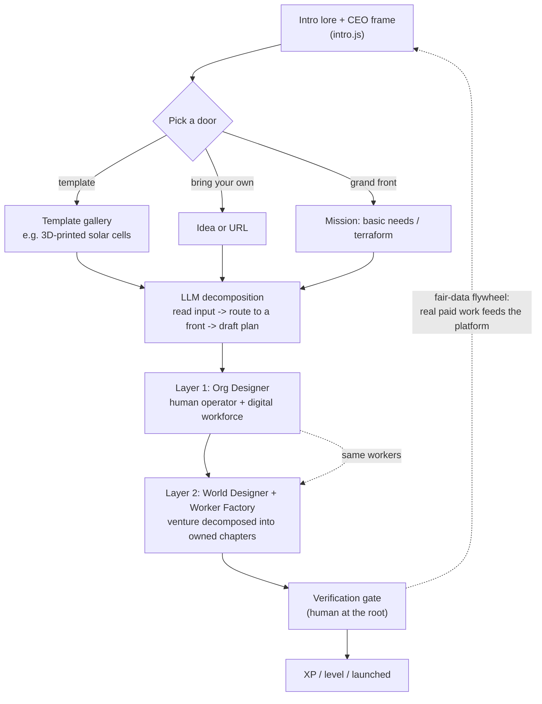

# Vision and Evolution - The Soul of the Build

> The canonical "why" document. It captures the full lore, the CEO role-play
> frame, the two missions, the digital-workforce thesis, and the fair-data
> flywheel - and it traces how the project evolved from a fantasy RPG reskin
> into a playable argument about how humans and AI run companies together.
>
> If you read only one doc to understand intent, read this one. Everything else
> in `submission/docs/` is the mechanism; this is the meaning.

Related docs:
[PROJECT_NARRATIVE.md](../../PROJECT_NARRATIVE.md) (origin strategy) -
[agents_league_alignment.md](agents_league_alignment.md) (Battle #2 mapping + Azure ecosystem) -
[architecture.md](architecture.md) (system shape) -
[game_loop.md](game_loop.md) (the loop) -
[org_designer_and_digital_workforce.md](org_designer_and_digital_workforce.md) (Layer 1) -
[world_designer_and_worker_factory.md](world_designer_and_worker_factory.md) (Layer 2) -
the maintainer's demo-readiness checklist (gitignored `submission/private/`) -
[rubric_mapping.md](rubric_mapping.md) (how it scores).

---

## 1. The one-line frame

**You role-play a CEO. A Microsoft Foundry agent workforce runs your company.
You approve every gate.**

And one line under it, for the people we are really building for: **it is a
teaching tool disguised as a game - based on a true story, our story - that hands
a technical builder a concrete path to start.**

That pair of sentences is the whole pitch. The rest of this document explains why
each word was chosen, where it came from, and how the build grew to support it.

---

## 2. The lore (the art piece)

The intro is not decoration. It is the argument, delivered as lore so the
presenter does not have to narrate the reasoning out loud on stage. The game
explains itself. The arc, card by card, lives in
[ui/game/intro.js](../ui/game/intro.js):

1. **The premise - every company is two companies.** One is the handful of
   people who decide. The other is all the work that has to get done. For the
   first time, that second company can be made of agents.
2. **Your seat - you are the CEO, and you want the impossible.** Terraform the
   Sahara. Build new cities where there is only sand. It is too big to command
   into existence - so how could anyone actually do it?
3. **The only way - you cannot command a billion people, you align them.**
   Automate the production and distribution of basic needs (food, water,
   energy, shelter) and a billion humans, and their AI, finally have a reason
   to pull the same way.
4. **The mechanism - so you build an agency of digital workers.** Every person
   with a skill binds it to a digital worker that does the execution. Their
   experience becomes a business that runs while they sleep - income they earn,
   not income they wait for. This is UBI-by-construction, not UBI-by-handout.
5. **The flywheel - and everyone gets paid, fairly.** The platform learns from
   real people doing real work, paid evenly - not scraped the way today's
   models were. Even a superintelligence still needs the grassroots: a million
   humans who know what it cannot, and who can tell it what to do when it
   hallucinates or hits the edge of its training.
6. **How it thinks - every agent that reasons runs on Foundry.** Foundry IQ for
   memory, a code interpreter for checks it cannot fake, and multi-agent
   orchestration that turns them into a team.
7. **Why you can trust it - a human stays at the root of everything.** No
   artifact counts until you approve it at a verification gate. That one rule
   is the difference between a colleague and a slop machine.
8. **Your turn - the vision is the CEO's, the path is yours.** You bring the
   skill and the judgment. Your agent workforce brings the execution. Pick the
   front you want to carve, and make it yours.

The closing card is a **choice screen**, not a wall of text. See section 4.

### The tightened arc (if the clock is short)

Eight cards is the full cut. The three beats that must land, in order, are:
**(1) the vision is too big to command -> (2) so you build an agency of digital
workers -> (3) and a human stays at the root of every result.** Premise,
flywheel, and Foundry detail are support; if time is tight, cut to these three.
The arc survives at three cards - that is the simplify pass.

### Why this lore matters for the competition

Battle 2 rewards visible reasoning and role-play. The lore earns both at once: it
gives the player a **reason to reason** (a mission too big to brute-force, so
delegation is the only path), puts them **in character** (a CEO with a workforce,
not a user of a chat box), and makes the **Foundry and human-at-the-root choices
read as deliberate**, not incidental.

---

## 3. The CEO role-play frame

The strongest version of this demo is not "type a prompt and watch output." It
is "sit in the CEO's chair and feel what it is like to run a company through an
agent workforce."

That reframe changes the input. The player brings:

- **A company or an idea** - the thing they want to build.
- **Their edge** - the skill, experience, or knowledge they personally carry.

And the system returns an **org of digital workers** plus a **decomposed venture**
that the workforce executes under the player's approval. The player is the human
at the root; the agents are the second company.

This is where the personalization lives. The vision belongs to the CEO, but the
**path is the player's** - they choose the mission, they bring the skill, they
approve or reject each artifact. The intent is that a player feels the venture
is *theirs*, even though it serves a larger vision.

---

## 4. How a player gets in: three on-ramps, one loop

The grand vision is huge on purpose - but a newcomer needs a door they can walk
through in thirty seconds. So the input is not one blank field; it is **three
on-ramps that all converge on the same Org Designer -> World Designer ->
verification loop**:

1. **Pick a template (the fastest door).** A small gallery of concrete starting
   ventures the player can click. Templates are the teaching device: each is a
   worked example of a real business, pre-wired to a front of the larger mission.
2. **Bring your own (idea or URL).** Type a one-line idea, or paste a company URL
   the game scrapes (with SSRF guards). This is the "is this real?" door - point
   it at something you know and watch it map.
3. **Choose a grand front.** The two missions - automate basic needs, terraform
   the Sahara - for players who want to start from the vision and work down.

### The decomposition that routes them

Whichever door they pick, a Foundry LLM **reads the input and decomposes it**: it
infers what the company is, **routes it to the front of the larger story it
serves** (3D-printed solar cells -> the energy wedge of "automate basic needs"),
and drafts the org plus the venture. That routing is the connective tissue this
review surfaced. Today the org/venture decomposition is **live** (Layers 1-2),
but the **front-routing and the template gallery are the next on-ramp to build** -
small, high-leverage, and the thing that turns a clever demo into something a
stranger can start. See the placeholder note in section 8.

### The template gallery (the click-to-start door)

| Template (click to start) | Front of the larger story |
|---|---|
| 3D-printed solar cells for off-grid homes | Basic needs - energy |
| Hydroponic micro-farm kits | Basic needs - food |
| Modular water purification units | Basic needs - water |
| Flat-pack rapid shelter | Basic needs - shelter |
| Solar microgrid + soil regeneration service | Terraform the Sahara |
| Bring your own idea or URL | Routed by the LLM |

### The grand fronts (start from the vision)

Defined in `MISSIONS` in [ui/game/intro.js](../ui/game/intro.js):

| Pick | Company | Builds toward |
|---|---|---|
| **Mission A - Automate basic needs** | The Commons Project | Food, water, energy, shelter logistics. |
| **Mission B - Terraform the Sahara** | Sahara Forge | Water routing, microgrids, soil, new-city logistics. |
| **Own brief** | (live default) | The Agency of Poly meta-example. |

Keyboard on the choice card: `1`/`A` for Mission A, `2`/`B` for Mission B, `Esc`
to skip to the freeform pitch. No auto-start - picking a door reveals the pitch
screen and focuses Begin, so the run stays under human control on stage.

Every door also takes the player's **edge** (their real skill), appended to the
brief as "The founding operator's edge: ...", so the org the agents design is
shaped by who the player actually is. The vision is the CEO's; the path is the
player's.

---

## 5. The fair-data flywheel (the deeper thesis)

The lore's fifth card carries the part of the vision that is easy to miss and
most worth keeping: **the digital-worker platform is also a fair-data engine.**

- People bind their real skills to digital workers and get paid for the work.
- The platform learns from that real, paid, consented work - evenly, across many
  people - instead of scraping the open web the way today's frontier models were
  trained.
- That keeps a human in the loop structurally: AI can hallucinate, and even a
  superintelligence eventually needs a grassroots of humans who know the things
  it cannot. The platform is the mechanism that keeps those humans paid and
  in the loop.

This is the ethical and economic spine under the game. It is why the
verification gate is not a UX nicety but the core mechanic: the human at the
root is the whole point.

---

## 6. Who this is for, the funnel, and the proof that it is real

This is not a demo that ends when the applause does. The durable goal is to
**teach the people most likely to build this** - technical engineers, the
developers who read the blog post, the curious who saw "agency of digital
workers" and wondered if it was real - and to hand them a path to start.

So the game is a funnel disguised as lore: **play** (take the chair, pick a door,
watch a workforce build) -> **wonder** ("is this true? is this real?") ->
**join** (the same loop is the on-ramp to the real platform) -> **learn** (every
template and chapter is a lesson: discovery, org design, GTM, retention - idea to
first customers).

The honest answer to "is this real?" is the strongest hook we have: it is **based
on a true story - our story.** The platform the game describes is the platform
that built it; the journey it teaches is the one the maintainer is living in
public, not a fantasy. And the most convincing proof is that we point the game at
ourselves.

To do exactly that, the live default maps **Agency of Poly** ("a digital
workforce you hire instead of software you operate"). Its real product
positioning is the game's own thesis - human-governed autonomy, approval gates, a
workforce of digital workers. The game maps the company that built the game: the
"companies to companies" meta moment, a literal playable argument that the tool
designs the kind of organization its own maker is.

---

## 7. The three layers, brought together

The whole reason this document exists is to connect three things the build grew
in sequence. The seam between them is now closed: the workers Layer 1 invents are
the same workers Layer 2 runs.

| Layer | What the audience sees | Lives in |
|---|---|---|
| **1 - Org Designer** | A pitch or URL becomes one human operator + a workforce of digital workers, each with a `why`, with leverage and burn shown. | [agents/org_designer.py](../agents/org_designer.py), `/api/company/analyze` |
| **2 - World Designer + Worker Factory** | The venture decomposes into chapters; each chapter is owned by one designed worker, executed on Foundry, validated, gated. | [agents/world_designer.py](../agents/world_designer.py), [agents/worker_factory.py](../agents/worker_factory.py), `/api/world/*` |
| **3 - Intro + CEO role-play** | The game introduces itself (skippable lore), then hands the CEO chair with a mission or Poly pre-loaded. | [ui/game/intro.js](../ui/game/intro.js), [ui/story.html](../ui/story.html), [ui/game/story.js](../ui/game/story.js) |

Design-time reasoning (who should be on this team?) feeds run-time reasoning
(now that team builds the venture). That is the multi-step reasoning story the
rubric asks for. See [architecture.md](architecture.md) for the system diagram
and [rubric_mapping.md](rubric_mapping.md) for how each layer scores.

---

## 8. Evolution of the project

This is the through-line - how the build became what it is.

Eras at a glance:

| Era | From -> To | The shift |
|---|---|---|
| 0 | Starter kit -> our build | Fantasy Game Master reskin for business. |
| 1 | Quest -> org | Input becomes an org: one human + a digital workforce. |
| 2 | Org -> venture | The designed workers actually build the venture. |
| 3 | Sprites -> geometry | Drop licensed art; geometric-first, MIT-clean. |
| 4 | Tool -> meaning | Lore, CEO frame, missions, fair-data, Poly-maps-itself. |
| 5 | Geometry -> generated art | Foundry MAI-Image-2e paints the game's own art - MIT, pluggable. |
| Next | Demo -> doorway | Templates + LLM front-routing: a stranger starts in 30s. |

### Phase 0 - The fantasy reskin (origin)

The project began as a direct reskin of the canonical Game Master example in
[live_battle_challenge.md](../../starter-kits/2-reasoning-agents/live_battle_challenge.md):
a Master Narrator decomposes a business pitch into a quest line, and specialist
character agents (Strategist, Designer, Marketer) produce artifacts the player
approves at verification gates. The strategy is captured in
[PROJECT_NARRATIVE.md](../../PROJECT_NARRATIVE.md), and the original agent shape
still shows in [architecture.md](architecture.md). The core pattern -
orchestrator + character agents + tools + shared state + human gates - has been
the constant map the whole time.

### Phase 1 - From "quest" to "org": the URL-to-org-chart turn

The build matured past generic fantasy quests into something with a real thesis:
take a **pitch or a URL**, understand the company, and design the **organization
it needs** - not as one chart but as two, a human org chart and a digital-worker
org chart, side by side. This is the Org Designer
([org_designer_and_digital_workforce.md](org_designer_and_digital_workforce.md)).
The output is one human operator plus a workforce of digital workers, each with a
plain-language `why`, plus leverage and monthly burn. URL scraping (with SSRF
guards) lets a real company be mapped from its own site.

### Phase 2 - The venture, decomposed: World Designer + Worker Factory

The seam closed here. The workers the Org Designer invents became the workers
that actually do the work: the World Designer decomposes the venture into
chapters, and the Worker Factory assigns each chapter to one designed worker,
who executes it on Foundry, grounded by Foundry IQ memory and checked by a code
interpreter, gated by a human. See
[world_designer_and_worker_factory.md](world_designer_and_worker_factory.md).
This is where the three required Foundry primitives all became visible in one
loop.

### Phase 3 - The presentation pivot: geometric-first, sprites out

An early direction used licensed sprite/tileset art for game-feel. The licensing
would not let the repo be cleanly open-sourced under MIT, so the build pivoted to
a **geometric-first** renderer (Phaser shapes plus a narrated story view) and
synthesized audio - no licensed assets in the public path. See the presentation
boundaries in [architecture.md](architecture.md), the game-feel rationale in
[game_loop.md](game_loop.md), and [sprite_game_mechanics.md](sprite_game_mechanics.md)
for the legacy sprite notes. The dark, narrated **story view (`/story`) is the
single hero surface** we present and ship. The retired `/geometric` prototype was
removed to keep one clean path. The legacy sprite view has been removed
entirely - the story view is the single UI. Its Limezu art was never committed
(license forbids redistribution), and the repo remains fully procedural plus
Foundry-generated portraits after `git clone`.

Naming the genre honestly: what this is now is a **narrated management RPG** -
visual-novel-style lore and choices, tycoon-style company building, and RPG
progression where the verification gate is the core mechanic. The player verb is
*decide*, not *walk*. That genre is the right one for a reasoning battle: the
reasoning artifacts (org charts, decomposition graphs, validator scores) ARE the
graphics, so the genre makes reasoning visible instead of hiding it.

### Phase 5 - The game paints itself: Foundry-generated art

The licensing review closed one door (third-party sprite packs cannot be
redistributed under MIT) and the official spec opened a better one: image
generation is an explicitly recommended tool in
[live_battle_challenge.md](../../starter-kits/2-reasoning-agents/live_battle_challenge.md)
("portraits, monsters, artifacts, maps"). So the build now uses **Microsoft's
MAI-Image-2e** (deployed and verified on a Foundry account) to generate the
game's own art - worker portraits, mission key-art - in the game's dark
navy/teal style. The thesis closes a loop: *the game generates its own art the
same way it generates its own org.* The Org Designer invents a worker; the image
model paints that worker's face. Why 2e specifically: it has the **highest RPM
quota of the MAI family** and ~4x the efficiency of MAI-Image-2 - not
best-in-class quality, and that is the deliberate trade for generated game art
at scale. Generated outputs are ours to commit under MIT, and the whole thing is
**pluggable**: three env vars (`IMAGE_ENDPOINT`, `IMAGE_DEPLOYMENT`,
`IMAGE_API_KEY`) and a documented one-command deployment let any forker test
with their own model. See [.env.example](../.env.example) and
[agents_league_alignment.md](agents_league_alignment.md) section 4.

### Phase 4 - The self-introducing lore and the CEO frame (current)

The most recent layer is the one this document is mostly about: a skippable
**intro that tutorializes the reasoning** the way a game teaches lore, a reframe
around **CEO role-play**, a **two-mission choice screen** as an early playable
placeholder, the **fair-data flywheel** spelled out, and **Agency of Poly** set
as the worked example so the game maps its own maker. The grand vision -
terraform the Sahara, automate basic needs, a human at the root of an AI
workforce - became the spine that ties the mechanism to the meaning.

### What is intentionally still a placeholder

- **The on-ramp (templates + LLM front-routing) is the next thing to build.**
  Today the org/venture decomposition is live, but a player still starts from a
  near-blank field or a grand mission. The template gallery (click "3D-printed
  solar cells" and go) and the LLM step that routes any input to the front it
  serves are designed (section 4) and not yet wired. They are small and the
  highest-leverage next move: they turn the demo into a doorway.
- The two missions are a menu of two, not a branching campaign. The "find your
  own journey by skill" idea is present (the edge input shapes the org) but not
  yet a distinct mechanic.
- The "build-in-public / first-customers" personal-journey angle is implied by
  the GTM and Retention chapters, not yet its own visible beat.
- In simulation mode, some chapter `why` copy is startup-generic and can read
  oddly against a grand mission like "terraform the Sahara." Live Foundry tailors
  it; simulation trades tailoring for never breaking on stage.

---

## 9. How the pieces connect (map)

- The lore sets up **why** (sections 2, 5).
- The three on-ramps + the routing decomposition set up **who and what**
  (sections 3, 4).
- Layers 1 and 2 are the **how** (section 7; their own docs go deeper).
- The verification gate is the **trust** (the human at the root).
- The audience, the true story, and Poly-maps-itself are the **proof**
  (section 6).

For the minute-by-minute run of all of this on stage, see
the maintainer's demo-readiness checklist (gitignored `submission/private/`). For scoring, see
[rubric_mapping.md](rubric_mapping.md).

---

## 10. One sentence to remember

Most agent demos ask you to trust a chat box; this one puts you in the CEO's
chair with a vision too big to command, hands you an agency of digital workers
to align a billion people toward it, and lets nothing count until you, the human
at the root, approve it.
