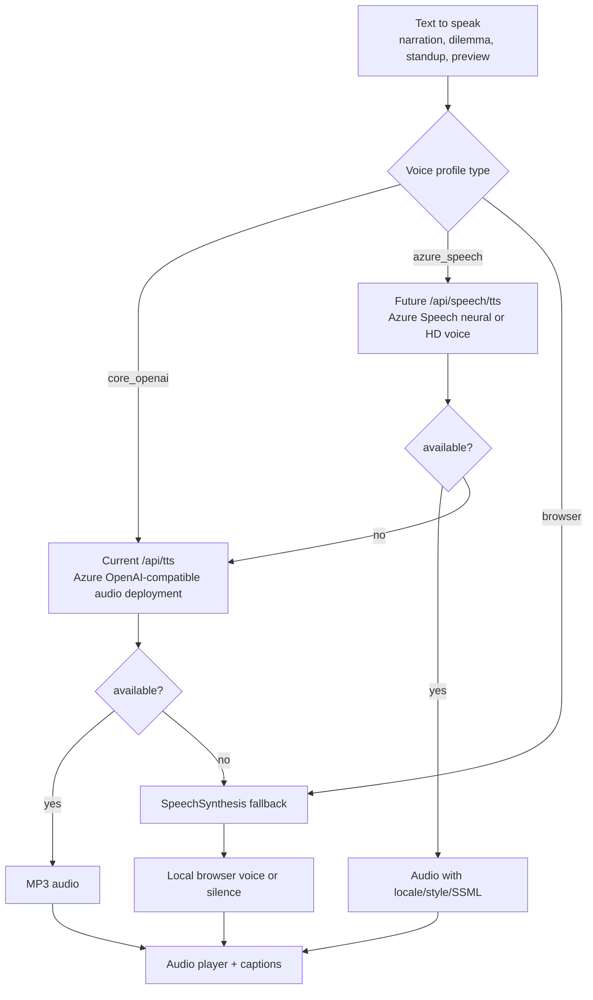
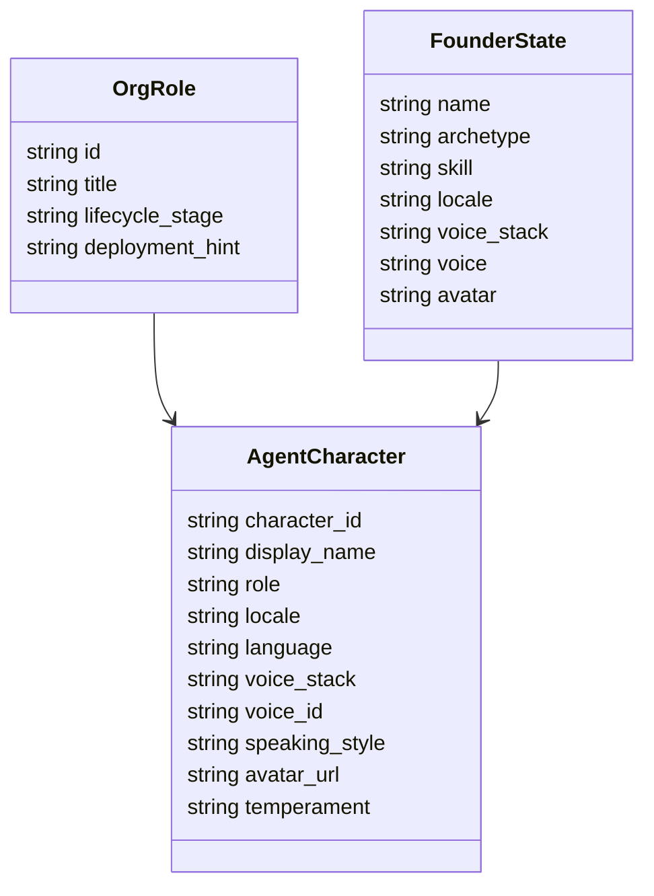
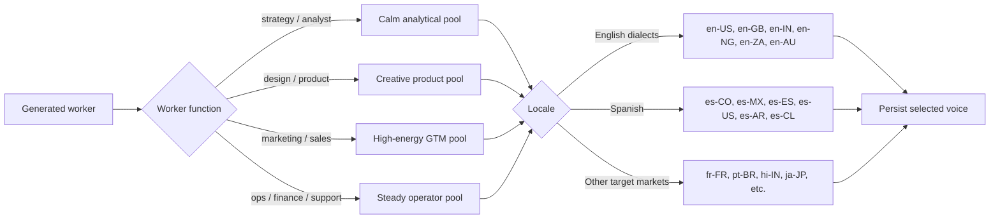
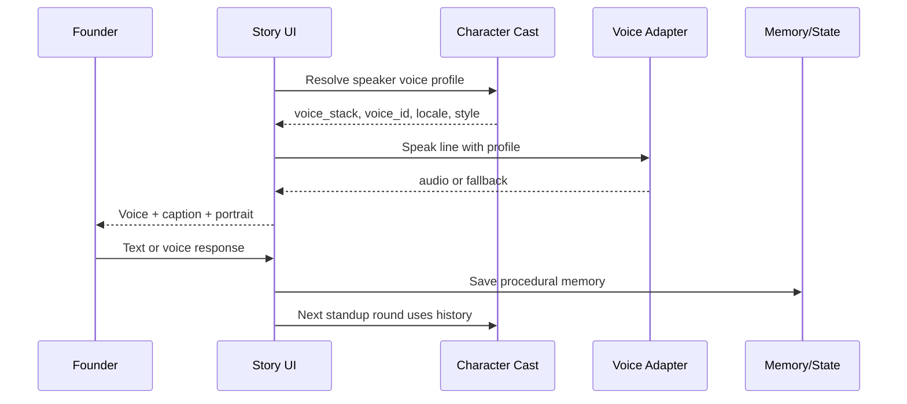
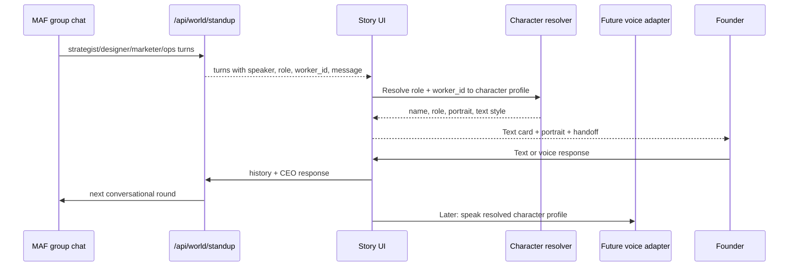
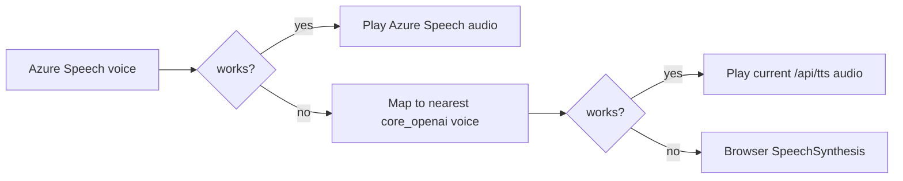

# Voice Casting And Localization Strategy

This document defines how voice should work in "Gamifying World Improvement":
the founder, game master, worker party, dilemmas, and standups should sound
like a diverse living company, while the game remains forkable with no paid
voice dependency.

## 1. The Important Distinction

There are three voice stacks we should not confuse:

| Stack | Current role | Strength | Limitation |
| --- | --- | --- | --- |
| Azure OpenAI-style TTS | Current `/api/tts` path using `TTS_ENDPOINT`, `TTS_DEPLOYMENT`, `TTS_API_KEY` and voices like `onyx`, `alloy`, `shimmer` | Simple API shape, strong expressive narrator/cast voices, already integrated | Small named voice set compared with Azure Speech |
| Azure OpenAI GPT Realtime | Future low-latency browser conversation layer for live speech-in/speech-out | WebRTC/WebSocket/SIP, realtime interruption, designed for voice agents | Needs a session broker and cannot replace character state, tool traces, or persisted transcript by itself |
| Foundry Voice Live | Future production voice-agent layer for speech-to-speech, Azure Speech voices, avatars, interruption handling, and action triggers | Managed STT + LLM + TTS path, broad locale coverage, supports multiple generative models | Larger integration surface; should sit behind the same character runtime contract |
| Azure AI Speech voices | Future diversity/localization layer using Azure Speech neural/HD voices | Large multilingual catalog, dialect coverage, SSML, styles/roles, regional voices | Needs a separate adapter and voice catalog model |
| Browser SpeechSynthesis | Offline fallback | Free, no keys, good enough as last resort | Voice availability depends on local browser/OS |

Microsoft's current documentation lists the GPT Realtime API as the
low-latency speech-in/speech-out path, with WebRTC recommended for browser
latency. The currently listed realtime model family includes
`gpt-realtime-1.5`, `gpt-realtime`, and `gpt-realtime-mini`. Voice Live is the
broader managed Foundry voice-agent path: it combines speech recognition,
generative AI, text to speech, optional avatars, action triggers, and Azure
Speech voices behind a WebSocket-compatible event model. Azure Speech remains
the broad voice catalog for regional and multilingual casting.

Decision: keep the demo on the existing `/api/tts` character voice path and
support `TTS_DEPLOYMENTS` as an ordered upgrade chain. Treat GPT Realtime and
Voice Live as the next transport layer, not as the source of truth. The source
of truth is the character runtime state: speaker identity, transcript,
tool calls, handoff, voice profile, and artifacts.

Long-term voice catalog: Azure Speech should become the game voice library.
These are game characters, so the breadth of dialects, languages, and HD
personas is not a side feature; it is part of the fantasy of a living digital
workforce. The reason to gate it in the first slice is only technical: the app
needs a working `/api/speech/tts` adapter before we let players select Azure
Speech voices that must actually speak.

References:

- Azure OpenAI GPT Realtime API:
  https://learn.microsoft.com/en-us/azure/foundry/openai/how-to/realtime-audio
- Azure AI Voice Live API:
  https://learn.microsoft.com/en-us/azure/ai-services/speech-service/voice-live
- Azure Speech language and voice support:
  https://learn.microsoft.com/en-us/azure/ai-services/speech-service/language-support
- Azure Speech HD voices:
  https://learn.microsoft.com/en-us/azure/ai-services/speech-service/high-definition-voices

## 2. Product Goal

The user should feel like they are sitting at a diverse round table:

- The game master has a consistent cinematic voice.
- Each core worker has a distinct voice, face, color, and speaking style.
- The founder can choose a voice and language identity during character creation.
- Generated workers can inherit voice families based on role, region, and locale.
- Dilemmas and standups can include English dialects, Spanish voices, and other
  localized characters intentionally, not randomly.
- Captions always keep the experience playable when audio fails.

## 3. Voice Stack Diagram



## 4. Character Voice Model

We should introduce a stable character voice profile rather than storing only a
bare voice string.



Minimum fields to add later:

- `locale`: `en-US`, `en-GB`, `en-NG`, `en-IN`, `es-CO`, `es-MX`, etc.
- `voice_stack`: `core_openai`, `azure_speech`, or `browser`.
- `voice`: the actual ID passed to the selected stack.
- `speaking_style`: short delivery direction: calm, energetic, precise,
  empathetic, operator-like, etc.

## 5. Core Cast Defaults

Keep the current small cast stable. Continuity matters more than maximum voice
variety for the main characters.

| Character | Role | Locale | Current voice family | Direction |
| --- | --- | --- | --- | --- |
| World Designer | Game master / narrator | `en-US` | `onyx` | cinematic, warm, low, patient |
| Org Designer | Workforce architect | `en-US` | `sage` | measured, wise, exact |
| Strategist | Market / positioning | `en-GB` or `en-US` | `ballad` | calm, thoughtful, evidence-led |
| Designer | Product / experience | `en-US` | `coral` | bright, visual, precise |
| Marketer | Growth / launch | `en-US` | `verse` | energetic, persuasive |
| Operator | Runway / systems | `en-US` | `alloy` | steady, concise |
| Founder | Human CEO | chosen in character creation | chosen | player-defined |

The core cast can stay on the existing OpenAI-style TTS deployment because the
runtime already works and the voices are short IDs the UI can preview today.

## 6. Diversity Pools For Generated Workers

Generated digital workers should not all sound like the same six characters.
They should draw from curated pools by locale and function.



Rule: select a voice once when the worker is created, then persist it. Never
reroll voices on each render.

## 7. Founder Voice Selection

The founder creation screen should not expose 700 voices directly. That is too
much choice and slows the first minute.

Use two levels:

1. Simple mode: 6-10 curated founder voices.
2. Advanced mode: language/region selector, then voice selector.

Suggested first screen:

| Label | Stack | Voice | Use |
| --- | --- | --- | --- |
| Onyx | `core_openai` | `onyx` | deep, warm |
| Alloy | `core_openai` | `alloy` | crisp, neutral |
| Nova | `core_openai` | `nova` | bright |
| Shimmer | `core_openai` | `shimmer` | clear, detailed |
| Spanish - Colombia | `azure_speech` | curated `es-CO` voice | bilingual founder |
| English - Nigeria | `azure_speech` | curated `en-NG` voice | global English founder |
| English - India | `azure_speech` | curated `en-IN` voice | global English founder |

Until the Azure Speech adapter exists, non-core voices can be shown as planned
or disabled behind "coming soon" rather than silently mapping them to the wrong
voice.

## 8. Dilemmas And Standups

Dilemmas and standups are where voice diversity matters most because the player
is listening to a group of agents.



Each spoken turn should have:

- Speaker name.
- Locale.
- Voice ID.
- Caption text.
- Tool call or reason for speaking.
- Avatar/portrait.

## 9. MAF Standup Speech Priority

The immediate milestone is not audio. It is a clear, text-first multi-agent
conversation where every character visibly responds in the standup loop. Once
the MAF loop produces stable text turns, the UI can resolve a character profile
for each turn and speak it through the best available adapter.



Priority order:

1. Make the existing standup loop render every MAF agent turn as text with a
   stable speaker, role, portrait, handoff, and memory/evidence trace.
2. Make the CEO response loop text-first: CEO writes a response, agents answer
   in the next round, and the full history remains visible.
3. Persist a character profile for each generated worker so the same worker
   keeps the same name, portrait, role, and eventually voice across chapters.
4. Add voice playback for these already-working text turns using current
   `core_openai` voices.
5. Add `/api/speech/tts` and enable curated Azure Speech profiles.
6. Promote selected Azure Speech standard or DragonHDOmni voices into the core
   cast once the adapter is stable.

The player-facing test for the first slice is simple: when the strategist,
designer, marketer, and operator react to the CEO, the player should understand
who is speaking, what they believe, what they are handing off, and how the CEO's
reply changes the next round. Audio comes after that text loop is strong.

## 10. Implementation Plan

### Phase 1: Make the current system explicit

- Add a voice profile registry in `story.js` for the current core voices.
- Store founder `voice_stack`, `locale`, and `voice` in `FounderState`.
- Keep `/api/tts` exactly as the current working OpenAI-style path.
- Add docs and UI labels that make clear these are "core voices."

Status: implemented as the first safe slice. `FounderState` now carries
`locale`, `voice_stack`, and `voice`; `/api/voices` returns the core catalog and
planned Azure Speech profiles; the onboarding voice picker is catalog-backed.

### Phase 2: Add voice catalog endpoint

Add an endpoint such as:

```text
GET /api/voices
```

Return:

```json
{
  "default_stack": "core_openai",
  "core_openai": [
    {"id": "onyx", "label": "Onyx", "locale": "en-US", "tone": "deep warm"},
    {"id": "shimmer", "label": "Shimmer", "locale": "en-US", "tone": "clear detailed"}
  ],
  "azure_speech": {
    "available": false,
    "voices": []
  }
}
```

When Azure Speech is configured, populate `azure_speech.voices` from either:

- a curated static list checked into the repo, or
- the Azure Speech voices/list API, cached locally.

### Phase 3: Add Azure Speech TTS adapter

Add a second endpoint:

```text
POST /api/speech/tts
```

Request:

```json
{
  "text": "I will take the GTM room.",
  "voice": "es-CO-SalomeNeural",
  "locale": "es-CO",
  "style": "friendly",
  "rate": "0%",
  "pitch": "0%"
}
```

Fallback order for a speaker with `voice_stack=azure_speech`:



### Phase 4: Persist generated worker casting

Add a deterministic casting function:

```text
role + lifecycle_stage + target_market + worker_id -> character profile
```

It should assign:

- display name
- locale
- voice stack
- voice id
- avatar/portrait
- speaking style

Store this with the org or world graph so future chapters and standups reuse
the same identity.

## 11. Recommended Next Build Slice

The next practical implementation slice should focus on text-first MAF turns:

1. Add a `speaker_profile` object to each standup turn.
2. Resolve that profile from `worker_id`, `role`, and persisted cast data.
3. Ensure `renderAgentStandup` renders every MAF turn as a clear text card with
   speaker identity, role, handoff, and evidence/tool trace.
4. Add a simulation smoke test that verifies standup turns include speaker
   profiles and preserve CEO response history.
5. Add voice playback only after this text loop is stable, keeping actual audio
   on the existing `/api/tts` path until the Azure Speech adapter is ready.

This gives us the product model without risking the demo with a new TTS stack.

## 12. Open Questions

- Which markets should be first-class in the demo: US, Colombia, Mexico,
  Nigeria, India, UK, South Africa?
- Should the founder be allowed to choose a non-English voice before the game
  has translated UI copy?
- Do generated workers get locale from company URL/domain, founder preference,
  or scenario pack?
- Do standups stay in one language per session, or can bilingual workers switch
  languages intentionally?
- Should captions translate to the founder's selected language, or stay in the
  speaker's language?
