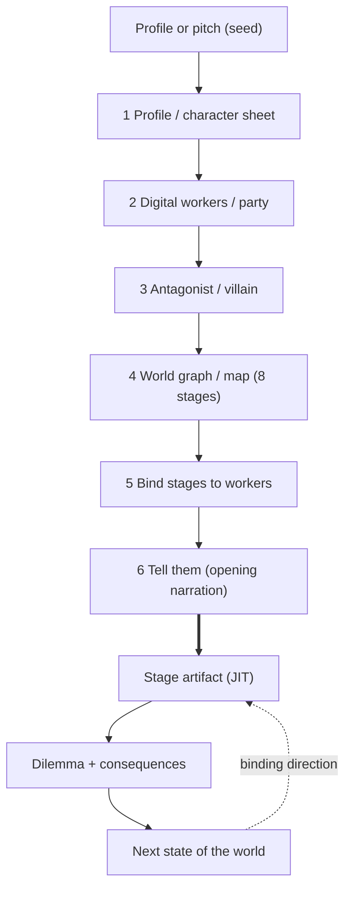
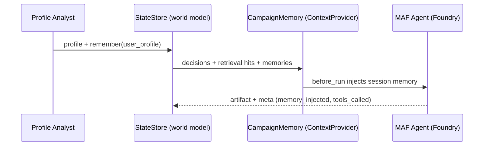

# World Generation Playbook: Hero's Journey, Digital Workforce, and the Antagonist

Source: QuestForge Narrative Library (original, MIT-licensed)

This playbook is the canonical generation order and world-state contract for the
game. It is written to be retrieved by Foundry IQ (and the local knowledge
fallback) when the World Designer and the digital workers reason about a stage,
so the same rules bind every run. Stage IDs and vocabulary are front-loaded so
per-stage retrieval (`brief + stage.goal + stage.success_metric`) recalls the
right beat.

## Generation order (what must exist before the player acts)

The cold open is generate-first; play is generate-as-you-go. Generate strictly
in this order, because each step is the input to the next:

1. PROFILE (the character sheet). Map the founder's public profile or pitch into
   archetype, skill, company summary, target customer, and signals. This is the
   seed every later generator reads.
2. DIGITAL WORKERS (the party). Design the org: one human operator plus the
   digital workers that form the execution layer. Economics are initialized from
   this workforce (monthly burn, leverage ratio, digital worker count).
3. ANTAGONIST (the villain). Forge the competitive foil from the founder's
   archetype opposite. The antagonist drives every stage dilemma, so it must
   exist before stage one and persist across the whole run.
4. WORLD GRAPH (the map). Produce exactly 8 Story Circle stages with a title,
   goal, and success metric each. Bind every stage to one of the digital workers
   so each stage has an owner.
5. TELL THEM (opening narration). The World Designer speaks the world back to the
   player: their seat, their party, their antagonist, and the first stage.

Everything after the cold open is generated just-in-time, one stage at a time,
and each stage's outcome becomes the next state of the world.

## The 8 Story Circle stages

Theme: grassroots, post-capitalist, cooperative automation. The founder automates
their basic needs by building an AI workforce.

- stage_1_you (YOU): The founder's ordinary world and current skill loop. Goal:
  establish the founder's lived assets, constraints, and comfort zone. Success
  metric: three founder assets and three constraints with evidence.
- stage_2_need (NEED): The unmet need the current system cannot satisfy. Goal:
  name the pressure that forces action and the villain gap it exposes. Success
  metric: a clear need, urgent beneficiary, and core tradeoff.
- stage_3_go (GO): Crossing the threshold into the service marketplace. Goal:
  position the founder's skill as a concrete promise. Success metric: first
  credible offer or ICP wedge the market can react to.
- stage_4_search (SEARCH): The road of trials. Goal: forge the AI workforce and
  MVP loop that can produce repeatable output. Success metric: a working loop,
  however small, with named worker ownership.
- stage_5_find (FIND): The traction signal. Goal: identify the proof, channel,
  or adoption pattern the antagonist cannot fake. Success metric: a proof-backed
  launch motion.
- stage_6_take (TAKE): The win has a cost. Goal: account for burn, support,
  rivalry, and moral pressure. Success metric: runway and support plan that
  keeps trust high.
- stage_7_return (RETURN): Bring the working loop back to the community and
  operating model. Goal: connect the system to governance, stakeholders, and
  sustainable cadence. Success metric: a worker-owned operating cadence.
- stage_8_change (CHANGE): The founder chooses the new normal. Goal: lock the
  final choice between shareholder capture and cooperative equilibrium. Success
  metric: durable trust, autonomy, and governance after the campaign.

## The antagonist escalates with the world

The antagonist is the founder's archetype opposite (Builder vs an operations
cartel, Seller vs an experience monopoly, and so on). It is forged once, before
stage one, and referenced by every dilemma. As the player clears stages, the
antagonist's threat escalates - later stages should reference the gap between the
founder's archetype and the antagonist's, so the tension grows rather than
resets.

## World-state contract (how a stage changes the next state)

The world model is the single source of truth (CompanyState in the StateStore).
Each stage runs the same loop:

1. The owning digital worker produces the stage artifact (an invocation on a
   Foundry deployment).
2. A human verification gate must pass before any reward is granted.
3. The player makes a CEO dilemma decision; its consequence mutates the
   economics and resources (burn, proof, trust, velocity, autonomy) and may
   escalate the antagonist.
4. The mutated state and the most recent decision become binding direction for
   the next worker, injected as session memory (the ContextProvider), not pasted
   into the prompt.

Binding rule for every worker: the artifact must visibly follow the most recent
CEO decision and the current world state. A stage that ignores the prior decision
is wrong, even if the artifact is otherwise good.

## Required game-state models

Do not treat the game as narration-only. A real roguelike run needs these
durable models in CompanyState:

- FounderProfile: the character sheet inferred from URL or pitch.
- OrgBlueprint and WorkerPartyMember: the designed workforce plus mutable party
  state (status, morale, fatigue, trust, current room).
- AntagonistState and AntagonistArc: the villain identity plus active pressure,
  threat level, antagonist moves, and counterplay.
- WorldGraph and WorldDay: the map plus each playable day/room snapshot.
- ChoiceRecord: every CEO decision with rule, tradeoff, and consequence.
- EncounterState: the playable rooms, including stage work, dilemmas,
  antagonist pressure, verification, and standup.
- InventoryItem: proof artifacts, tools, alliances, constraints, and other
  earned objects that later workers can cite.
- GameCard and PlayerMove: the deck-builder layer. The founder has deck, hand,
  discard, exhaust, pending reward draft, energy, turn index, and a move log.
  Playing cards must mutate economics, party state, antagonist pressure, or
  draw/discard state.
- SearchDocument: the Azure AI Search-shaped record that lets Foundry IQ
  retrieve any of the above when the next worker reasons.

If a mechanic changes the game but does not update one of these models, it is a
presentation effect, not gameplay.

## Card-building rules

The workforce cards and proof cards are not visual decoration. They are the
player's action economy:

1. At run start, seed a starter deck from the founder profile and designed org.
2. At each room/stage, start a turn: refill energy and draw to hand size.
3. The player may play cards from hand before or around dilemmas. Every play
   writes a PlayerMove with card, target, energy spent, and effects applied.
4. Played cards go to discard unless they exhaust. Stage rewards create a
   three-card draft; the player chooses one card, and only the chosen card enters
   discard. The deck evolves through explicit picks, not automatic grants.
5. Card effects can move proof/trust/velocity/burn/autonomy, worker morale or
   fatigue, antagonist threat, draw state, or counterplay resolution.
6. The next worker brief and Foundry IQ record must be able to retrieve the
   card move log. If the model cannot see what the player played, the deck is
   disconnected from the game.

## What is generated first vs in the background

- Generate first (blocking, the cold open): profile, digital workers, antagonist,
  world graph, opening narration. The player cannot act until these exist.
- Generate as you play (just-in-time): each stage artifact, its dilemma and
  consequences, and the next-state economics. These can stream in the background
  while the player reads narration, but a stage's inputs (prior decision + world
  state) must be resolved before that stage's worker runs.

## Diagrams (for humans; the rules above are what agents retrieve)

Generate-first vs generate-as-you-play:

Profile handoff to the agent (the injection seam):

